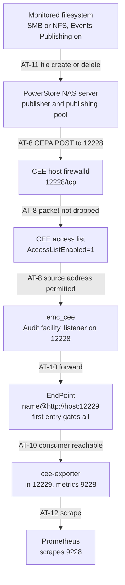

# CEE Ansible Deployment — Acceptance Tests

This is the test plan for the **first live deployment**. Every test below
is a test *to be run*. None of them has been run. Nothing in this document
records a result.

Work through `docs/ansible-deployment.md` and
`docs/powerstore-setup-runbook.md` for the procedures themselves — this
document does not repeat their steps, it says what to check and how to
recognise a lie.

## What is already verified, and what that is worth

Five things run today, all of them on a workstation or a CI runner:

| Command | What it actually proves |
|---|---|
| `ansible/tests/run.sh` | Five localhost playbooks: the config template renders the expected XML from known variables; the endpoint validator rejects loopback, bare hostnames and an empty list; the platform gate rejects Rocky and RHEL 8; the required-variable gate rejects an incomplete `group_vars`; and the sub-facility gate rejects a non-Audit selection, two enabled facilities, and none. Every negative test has been mutation-tested — its guard disabled, the test watched to fail, the guard restored. No host is contacted. |
| `cd ansible && ansible-playbook --syntax-check site.yml` | The playbook parses and every module named in it resolves. It does not execute a single task. |
| `yamllint ansible/ .github/` | Formatting. |
| `ansible-lint ansible/` | Rule compliance at the `production` profile. Idempotency claims in it are static heuristics, not observations. |
| `docker compose config` | The test stack's compose file is well formed. |

That is a real safety net for *authoring* mistakes and nothing more. In
particular, these checks cannot see anything that only exists at runtime:
a package that will not install, a daemon that will not start, a port a
firewall drops, an SELinux denial, a wrong address in a publishing pool.

## What has never been executed

Stated plainly, because the rest of this plan is calibrated against it:

- **No rpm has ever been installed by this code.** `cee_install` has never
  run against a RHEL host.
- **No `emc_cee` service has ever been started by this code.** The
  container path in this repo starts CEE a different way, through
  `entrypoint.sh`, not through the systemd unit these roles manage.
- **No PowerStore array has ever been configured from
  `docs/powerstore-setup-runbook.md`.** The procedure is transcribed from
  vendor documentation, not from a completed run.
- **No event has ever travelled the full path.** Not
  PowerStore → CEE, and not CEE → cee-exporter. The runbook's Stage 2
  probe exercises the consumer alone.
- **The GitHub Actions workflow has never run.** `.github/workflows/ansible.yml`
  has never completed on any runner.
- **The `ansible-galaxy collection install` step has never been exercised
  on a clean machine.** `ansible.posix` was already present on the
  development workstation, so a green local `ansible-lint` proves nothing
  about a checkout that does not have it. Test AT-1 exists for this
  reason.

## The event path

Each hop is a place the path can break, and each breaks with a different
signature. Locate the failure here before changing anything.

Two hops leave no trace anywhere when they fail. A packet dropped by
firewalld is invisible to CEE — no log line, no counter. A first
`<EndPoint>` that is down silently suppresses delivery to *every* other
endpoint. Both are covered below.

## Acceptance tests

Run in order. Each depends on the previous one having passed.

---

### AT-1 — Control node resolves its dependencies from a clean checkout

**Proves** the collection requirement is real and satisfiable, and that
`ansible.posix.firewalld` is not being resolved from a collection that
happens to be installed on one developer's machine.

**Do**, on a machine that has *not* run this playbook before, or with a
throwaway collections path:

    git clone <repo> && cd <repo>
    ANSIBLE_COLLECTIONS_PATH=$(mktemp -d) \
      ansible-galaxy collection install -r ansible/requirements.yml
    cd ansible && ansible-playbook --syntax-check site.yml

**Expect** the collection installs, and the syntax check exits 0.

**False pass** — the most likely one on this whole list. Running this on
your normal workstation proves nothing: `ansible.posix` is a dependency of
several other collections and of the full `ansible` package, so it is
probably already there. If you do not override
`ANSIBLE_COLLECTIONS_PATH`, or use a container, you have tested your
machine's history rather than the repo. Prove the negative first: remove
or shadow the collection and confirm the syntax check *fails* with
`couldn't resolve module/action 'ansible.posix.firewalld'`. If it still
passes, the requirement is being met from somewhere you have not
accounted for.

---

### AT-2 — CI runs green on a real runner

**Proves** the workflow file works, in the order its steps are written.

**Do** push the branch and watch:

    gh run list --workflow=ansible.yml
    gh run view --log-failed

**Expect** all six steps pass, with the collection install completing
before the syntax check and before ansible-lint.

**False pass** a cancelled or skipped run reports no failure. Confirm the
run's conclusion is `success` and that the `Install collection
dependencies` step actually appears in the log — if it is missing, the
runner is executing an older commit.

---

### AT-3 — The required-variable gate fires before anything touches the host

**Proves** a missing `group_vars/all.yml` produces a message naming the
problem, rather than a raw Jinja undefined several tasks later.

**Do**, with `ansible/group_vars/all.yml` temporarily renamed:

    cd ansible && ansible-playbook site.yml

**Expect** the play stops on `Every required variable must be defined`,
with a fail message listing every variable and pointing at
`group_vars/all.yml.example`. Nothing is written to the target host.

**False pass** if the play gets past this task and dies later — for
example on `Check whether the CEE port is already in use`, or on the
`Report a pre-existing listener` debug — the assert is not covering
everything it should. Note *which* variable it died on and add it to the
assert. Also confirm no file was created on the target: `ls -l
/etc/yum.repos.d/ubi.repo` should be unchanged.

Restore `all.yml` before continuing.

---

### AT-4 — The platform gate accepts the real host

**Proves** the target is genuine RHEL 9, the thing CEE self-terminates
over.

**Do** on the target: `cat /etc/redhat-release`, then run the playbook and
watch `cee_preflight`.

**Expect** `Red Hat Enterprise Linux release 9.x`, and the gate passes.

**False pass** the gate reads Ansible's `ansible_distribution` fact, not
the file CEE reads. On a host where the two disagree — a rebuild with a
doctored `redhat-release`, or a container base swapped underneath — the
gate passes and CEE still refuses. AT-7's log check is the authority; this
is the cheap early warning.

---

### AT-5 — The rpm installs, and its dependencies resolve from UBI

**Proves** outbound egress to `cdn-ubi.redhat.com` works, the disabled-repo
plus `enablerepo` scoping resolves dependencies, and the repos do not leak
into the host's permanent configuration.

**Do** on the target, after the run:

    rpm -qa | grep -i cee
    dnf repolist                       # UBI repos must NOT be listed
    dnf repolist --all | grep ubi-9    # they exist, disabled
    ls -l /etc/yum.repos.d/ubi.repo

**Expect** the CEE package is installed; `dnf repolist` does *not* show
`ubi-9-baseos-rpms` or `ubi-9-appstream-rpms`; `dnf repolist --all` shows
both as disabled; the repo file is present.

**False pass** `dnf repolist` being empty of UBI repos means nothing on
its own — it is also what you would see if the file failed to copy. Check
all three commands, not just the first. Conversely, if the UBI repos *do*
appear in plain `dnf repolist`, the `enabled = 0` change did not take
effect and the host's package sources have been permanently altered; on an
entitled host that can silently reroute unrelated packages away from the
subscription repos.

Note that this test is only meaningful on a host that actually needed to
pull dependencies. If the rpm's requirements were already satisfied by the
base install, dnf never contacted the CDN and the egress requirement is
untested. Check the dnf transaction in the playbook output: if nothing but
the CEE package was installed, force the issue on a minimal host, or
accept that this leg is unverified and say so.

---

### AT-6 — The rpm's signature was not verified, and you know it

**Proves** the accepted risk is the risk you think it is.

The Dell rpm is signed — RSA/SHA256, fingerprint
`F85417992FA59E0A84F1E2CCF4A476D807DD4467` — but Dell distributes that
public key only through their authenticated support portal, so it cannot
be vendored into this repo. `cee_install` therefore relies on dnf's
`localpkg_gpgcheck` default of off, and does **not** pass
`disable_gpg_check` (which would be transaction-wide and would also stop
verifying the UBI-sourced dependencies, which *are* verifiable).

**Do** on the target:

    rpm -qa | grep -i cee
    rpm -qi <that package name> | grep -Ei 'signature|key id'
    rpm -q gpg-pubkey --qf '%{SUMMARY}\n'
    python3 -c "import dnf; print(dnf.Base().conf.localpkg_gpgcheck)"

and, with the rpm file present:

    rpm -Kv bin/emc_cee_RHEL-9.2.0.0.x86_64.rpm

**Expect** the package is installed; `rpm -qi` reports a signature with
key ID `07dd4467`; the rpm keyring lists Red Hat's keys but **not** Dell's;
`localpkg_gpgcheck` is `False`; and `rpm -Kv` reports the header signature
as `NOKEY`.

**What this means.** The package installed because verification was
skipped, not because it succeeded. Its contents were trusted on the
strength of where the file came from — a manual download into `bin/` — and
nothing else. Integrity in transit from the support portal to this repo is
unverified by machine. If Dell's key is ever obtained, set
`localpkg_gpgcheck: true`, import the key on the target, and this test
becomes a real verification instead of a documented gap.

**False pass** if `rpm -Kv` reports `signatures OK`, someone has imported
Dell's key on that host and the gap is closed *there only* — it is still
open on every other host, and on the control node. Do not generalise one
host's result. If `rpm -qi` shows no signature at all, the rpm is not the
one this comment describes; stop and re-check the file's provenance.

---

### AT-7 — The service starts and CEE accepts the platform

**Proves** the unit the playbook manages is the unit the rpm ships, and
CEE's own platform check passed — not just Ansible's.

**Do** on the target:

    systemctl is-active emc_cee
    systemctl cat emc_cee | head -20
    ss -lntp | grep 12228
    grep -i 'platform' /opt/CEEPack/logs/*.log

**Expect** `active`; the unit is the rpm's, unmodified; a listener on
12228 owned by `emc_cee.exe`; and **no** `Platform is not supported`
anywhere in the log.

**False pass** `systemctl is-active` returning `active` for a unit with
`Restart=` and a crash loop is a known trap — check `systemctl status
emc_cee` for a restart count and `journalctl -u emc_cee` for repeated
starts. An empty log directory is not a pass either; it was the container's
exact failure signature. `cee_verify` asserts a log file exists, but a log
that exists and is empty still needs a human to look at it once.

---

### AT-8 — The inbound port is open *from the array's side*

**Proves** the firewalld change works, and closes the false pass this
whole branch was reviewed for.

**Do** on the CEE host:

    firewall-cmd --state
    firewall-cmd --list-ports

and then, **from a machine on the array's side of the network** — not from
the CEE host:

    nc -vz <cee-host> 12228

**Expect** firewalld `running`, `12228/tcp` in the port list, and the
remote `nc` connects.

**False pass** — the important one. Every local check lies here.
`cee_verify` probes `127.0.0.1`, `ss -lntp` reads the local socket, and
`nc -vz localhost 12228` from the CEE host itself all succeed on a
completely firewalled machine, because firewalld does not filter loopback.
Until this branch, a stock RHEL 9 host produced a fully green playbook run
and dropped every event PowerStore sent. **The off-host `nc` is the only
part of this test that proves anything.** If you cannot run it from the
array's subnet, run it from the closest host you can and treat the
remaining segment as untested.

Also test the negative path deliberately, once: set
`cee_manage_firewall: false`, re-run, and confirm the playbook still
reports success while the off-host `nc` now fails. That is what the
toggle costs, and an operator should have seen it once.

---

### AT-9 — SELinux does not interfere

**Proves** less than the others. Nothing on this branch examined SELinux
at all, so this test is exploration rather than confirmation — treat a
clean result as provisional.

**Do** on the target, after a full run:

    getenforce
    ls -Z /opt/CEEPack/emc_cee_config.xml /opt/CEEPack/emc_cee.exe
    ausearch -m AVC,USER_AVC -ts recent 2>/dev/null

**Expect** `Enforcing` on a stock host, sensible labels, and **no** AVC
denials.

**False pass** three ways, all of them likely:

- If `getenforce` says `Permissive` or `Disabled`, this test proved
  nothing at all about production. Note it and re-run somewhere
  enforcing.
- `ausearch` returning "no matches" is ambiguous — auditd may not be
  running. Confirm with `systemctl is-active auditd` first, otherwise a
  silent audit log reads exactly like a clean one.
- Denials can be *dontaudited* and never appear. If something behaves
  oddly with no visible cause, re-check with
  `semodule -DB` temporarily enabled.

Specific things worth looking at, because they are the plausible failures
rather than the theoretical ones: the config file is written by Ansible's
`template` module, which creates it elsewhere and moves it into place —
without `libselinux-python3`/`python3-libselinux` on the target, the
resulting label can be wrong. And port 12228 has no SELinux port type; if
`emc_cee.exe` turns out to run confined rather than as
`unconfined_service_t`, binding it will need `semanage port -a`. Neither
has been observed; both are cheap to check here.

---

### AT-10 — CEE forwards to the consumer, and the first endpoint gates all

**Proves** the outbound leg, and the ordering behaviour that is the
documented reason `cee_endpoints` order matters.

**Do** the runbook's Stage 2 first — see
`docs/powerstore-setup-runbook.md` — which proves the consumer is
reachable and parsing from the CEE host.

Then, if and only if `cee_endpoints` has more than one entry, test the
gating explicitly. Stop the consumer that is **first** in the list, cause
an event, and watch every other consumer.

**Expect** with the first endpoint down, *no* endpoint receives events —
including healthy ones later in the list.

**False pass** stopping the *second* endpoint and observing that the first
still receives events teaches you nothing; that is the behaviour you would
see under any model. The test only has content if you stop the first one.
And if you have a single endpoint configured, this behaviour is
unobservable — it is a landmine for whoever adds the second one later, not
a property you have verified. Record it as untested rather than passed.

---

### AT-11 — The full path, PowerStore to Prometheus

**Proves** everything at once, which is why it is last and why it is
useless for diagnosis on its own.

**Do** the runbook's Stage 3: create and delete a file on a monitored
filesystem.

**Expect** matching `CreateFile` and `DeleteFile` events reach
cee-exporter within a few seconds.

**False pass** an event that arrives may have arrived for a reason you did
not intend. Use a filename that could not come from anywhere else and grep
for that exact string; a counter that moved during a busy hour on a shared
array proves the path is *carrying traffic*, not that it carried *yours*.
If it fails, do not debug from here — go back to the flowchart above and
work out which hop, then run that hop's test.

---

### AT-12 — Metrics reach Prometheus

**Proves** the last hop, the one that makes any of this useful.

**Do**:

    curl -s http://<docker-host>:9228/metrics | grep '^cee_events_received_total'
    curl -sG http://<prometheus>:9090/api/v1/query \
      --data-urlencode 'query=cee_events_received_total'
    curl -sG http://<prometheus>:9090/api/v1/query \
      --data-urlencode 'query=up{job="cee-exporter"}'

**Expect** the counter is exposed, Prometheus returns it, and `up` is 1.

**False pass** Prometheus happily serves the last successful scrape long
after the target has died. A non-zero counter is not evidence the exporter
is alive right now — check `up` and the sample's timestamp, not just the
value.

---

### AT-13 — The run is idempotent

**Proves** a re-run converges instead of stacking state, which is what
makes this playbook safe to run during an incident.

**Do** run `ansible-playbook site.yml` twice in a row, unchanged.

**Expect** `emc_cee` is **not** restarted, and the second run's only
changed tasks are `cee_install`'s rpm staging pair — the copy to `/tmp`
and its removal. Those two report `changed` on every run by construction:
the rpm is staged and deleted each time, so `changed=0` is not achievable
today and expecting it would fail this test for the wrong reason. Anything
changed beyond those two is a real convergence bug.

**False pass** a low `changed` count with tasks skipped is not
convergence. Compare
the two runs' task lists — if `cee_manage_firewall` or the facility gate
skipped a block the second time, you measured a different playbook. Also
check `/opt/CEEPack/` for accumulating `emc_cee_config.xml.*` backup files:
the template task uses `backup: true`, so a new backup on every run means
the template is rendering differently each time even though the outcome
looks stable.

## Recording results

Do not edit this file with outcomes. Record them where the deployment is
tracked, with the host name, the CEE version, the date, and — for anything
marked untested above — say untested rather than leaving it blank. A blank
reads as a pass to the next person.
