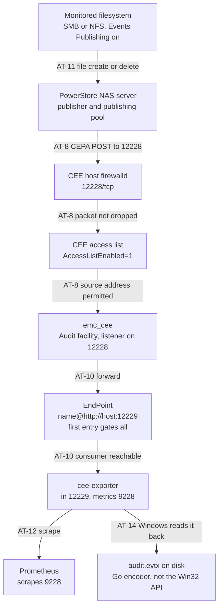

# CEE Ansible Deployment — Acceptance Tests

This is the test plan for the **first live deployment**. Every test below
is a test *to be run*. None of them has been run — on RHEL, on SLES, or
on any other platform. Nothing in this document records a result.

## Platform coverage

This plan targets the two platforms the Ansible roles implement: RHEL 9
and SLES 15. Nothing below is platform-specific by design — `cee_configure`
and `cee_verify` are shared task files because the two rpms ship an
identical payload, so the same checks and the same false-pass traps apply
to both. Where a test *is* platform-specific (AT-4's `/etc/redhat-release`
read, AT-5's UBI/dnf plumbing, AT-6's rpm path), that is called out in the
test itself; treat AT-4/AT-5/AT-6 as needing a SLES-flavoured re-read
(`/etc/os-release` or `/etc/SuSE-release`, `zypper` instead of `dnf`, the
SLES rpm) rather than a literal re-run of the RHEL commands, and run the
full sequence once per platform.

Windows Server is **phase 2, not implemented** — `cee_preflight`'s
OS-family gate rejects it outright — so no acceptance test here targets
it, and none of this plan has run against a Windows host either.

To be unambiguous about what that leaves standing: as of this document,
this plan has been executed against real hardware on **zero** platforms.
RHEL 9 and SLES 15 are both in scope for execution; neither has run.

Work through `docs/ansible-deployment.md` and
`docs/powerstore-setup-runbook.md` for the procedures themselves — this
document does not repeat their steps, it says what to check and how to
recognise a lie.

## What is already verified, and what that is worth

Five things run today, all of them on a workstation or a CI runner:

| Command | What it actually proves |
|---|---|
| `ansible/tests/run.sh` | Six localhost playbooks: the config template renders the expected XML from known variables; the endpoint validator rejects loopback, bare hostnames and an empty list; the OS-family dispatch gate rejects an unsupported family (e.g. Debian) by name; the platform gates reject Rocky, RHEL 8 and openSUSE Leap by name; the required-variable gate rejects an incomplete `group_vars`; and the sub-facility gate rejects a non-Audit selection, two enabled facilities, and none. Every negative test has been mutation-tested — its guard disabled, the test watched to fail, the guard restored. No host is contacted. |
| `cd ansible && ansible-playbook --syntax-check site.yml` | The playbook parses and every module named in it resolves. It does not execute a single task. |
| `yamllint ansible/ .github/` | Formatting. |
| `ansible-lint ansible/` | Rule compliance at the `production` profile. Idempotency claims in it are static heuristics, not observations. |
| `docker compose config` | The test stack's compose file is well formed. |

That is a real safety net for *authoring* mistakes and nothing more. In
particular, these checks cannot see anything that only exists at runtime:
a package that will not install, a daemon that will not start, a port a
firewall drops, an SELinux denial, a wrong address in a publishing pool.

## What has never been executed

Stated plainly, because the rest of this plan is calibrated against it:

- **No rpm has ever been installed by this code, on either platform.**
  `cee_install` has never run against a RHEL host or a SLES host.
- **No `emc_cee` service has ever been started by this code, on either
  platform.** The container path in this repo starts CEE a different way,
  through `entrypoint.sh`, not through the systemd unit these roles
  manage, and it is RHEL-only besides.
- **No PowerStore array has ever been configured from
  `docs/powerstore-setup-runbook.md`.** The procedure is transcribed from
  vendor documentation, not from a completed run.
- **No event has ever travelled the full path.** Not
  PowerStore → CEE, and not CEE → cee-exporter. The runbook's Stage 2
  probe exercises the consumer alone.
- **No `.evtx` this repo produced has ever been read by Windows.** The
  file is written by a non-Windows build through a Go encoder, and every
  check available on macOS or RHEL passes identically on a valid file and
  on a corrupt one. AT-14 exists for this and needs a Windows host.
- **The GitHub Actions workflow has never run.** `.github/workflows/ansible.yml`
  has never completed on any runner.
- **The `ansible-galaxy collection install` step has never been exercised
  on a clean machine.** `ansible.posix` was already present on the
  development workstation, so a green local `ansible-lint` proves nothing
  about a checkout that does not have it. Test AT-1 exists for this
  reason.

## The event path

Each hop is a place the path can break, and each breaks with a different
signature. Locate the failure here before changing anything.

Two hops leave no trace anywhere when they fail. A packet dropped by
firewalld is invisible to CEE — no log line, no counter. A first
`<EndPoint>` that is down silently suppresses delivery to *every* other
endpoint. Both are covered below.

The `audit.evtx` branch is not a hop — the events have already arrived by
then. It is drawn because the file's *validity* is a separate claim from
its existence, and only a Windows host can settle it.

## Acceptance tests

Run in order. Each depends on the previous one having passed.

---

### AT-1 — Control node resolves its dependencies from a clean checkout

**Proves** the collection requirement is real and satisfiable, and that
`ansible.posix.firewalld` is not being resolved from a collection that
happens to be installed on one developer's machine.

**Do**, on a machine that has *not* run this playbook before, or with a
throwaway collections path:

    git clone <repo> && cd <repo>
    export ANSIBLE_COLLECTIONS_PATH="$(mktemp -d)"
    ansible-galaxy collection install -r ansible/requirements.yml
    (cd ansible && ansible-playbook --syntax-check site.yml)

`export` on its own line is load-bearing. A `VAR=... command` prefix
applies to that one command only, so writing it that way would scope the
throwaway path to `ansible-galaxy` and let the syntax check fall back to
your normal collections — which is exactly the false pass described
below, wearing the costume of the fix for it.

**Expect** the collection installs, and the syntax check exits 0.

**False pass** — the most likely one on this whole list. Running this on
your normal workstation proves nothing: `ansible.posix` is a dependency of
several other collections and of the full `ansible` package, so it is
probably already there. If you do not override
`ANSIBLE_COLLECTIONS_PATH`, or use a container, you have tested your
machine's history rather than the repo. Prove the negative first: remove
or shadow the collection and confirm the syntax check *fails* with
`couldn't resolve module/action 'ansible.posix.firewalld'`. If it still
passes, the requirement is being met from somewhere you have not
accounted for.

---

### AT-2 — CI runs green on a real runner

**Proves** the workflow file works, in the order its steps are written.

**Do** push the branch and watch:

    gh run list --workflow=ansible.yml
    gh run view --log-failed

**Expect** all six steps pass, with the collection install completing
before the syntax check and before ansible-lint.

**False pass** a cancelled or skipped run reports no failure. Confirm the
run's conclusion is `success` and that the `Install collection
dependencies` step actually appears in the log — if it is missing, the
runner is executing an older commit.

---

### AT-3 — The required-variable gate fires before anything touches the host

**Proves** a missing `group_vars/all.yml` produces a message naming the
problem, rather than a raw Jinja undefined several tasks later.

**Do**, with `ansible/group_vars/all.yml` temporarily renamed:

    cd ansible && ansible-playbook site.yml

**Expect** the play stops on `Every required variable must be defined`,
with a fail message listing every variable and pointing at
`group_vars/all.yml.example`. Nothing is written to the target host.

**False pass** if the play gets past this task and dies later — for
example on `Check whether the CEE port is already in use`, or on the
`Report a pre-existing listener` debug — the assert is not covering
everything it should. Note *which* variable it died on and add it to the
assert. Also confirm no file was created on the target: `ls -l
/etc/yum.repos.d/ubi.repo` should be unchanged.

Restore `all.yml` before continuing.

---

### AT-4 — The platform gate accepts the real host

**Proves** the target is genuine RHEL 9, the thing CEE self-terminates
over.

**Do** on the target: `cat /etc/redhat-release`, then run the playbook and
watch `cee_preflight`.

**Expect** `Red Hat Enterprise Linux release 9.x`, and the gate passes.

**False pass** the gate reads Ansible's `ansible_distribution` fact, not
the file CEE reads. On a host where the two disagree — a rebuild with a
doctored `redhat-release`, or a container base swapped underneath — the
gate passes and CEE still refuses. AT-7's log check is the authority; this
is the cheap early warning.

---

### AT-5 — The rpm installs, and its dependencies resolve from UBI

**Proves** outbound egress to `cdn-ubi.redhat.com` works, the disabled-repo
plus `enablerepo` scoping resolves dependencies, and the repos do not leak
into the host's permanent configuration.

**Do** on the target, after the run:

    rpm -qa | grep -i cee
    dnf repolist                       # UBI repos must NOT be listed
    dnf repolist --all | grep ubi-9    # they exist, disabled
    ls -l /etc/yum.repos.d/ubi.repo

**Expect** the CEE package is installed; `dnf repolist` does *not* show
`ubi-9-baseos-rpms` or `ubi-9-appstream-rpms`; `dnf repolist --all` shows
both as disabled; the repo file is present.

**False pass** `dnf repolist` being empty of UBI repos means nothing on
its own — it is also what you would see if the file failed to copy. Check
all three commands, not just the first. Conversely, if the UBI repos *do*
appear in plain `dnf repolist`, the `enabled = 0` change did not take
effect and the host's package sources have been permanently altered; on an
entitled host that can silently reroute unrelated packages away from the
subscription repos.

Note that this test is only meaningful on a host that actually needed to
pull dependencies. If the rpm's requirements were already satisfied by the
base install, dnf never contacted the CDN and the egress requirement is
untested. Check the dnf transaction in the playbook output: if nothing but
the CEE package was installed, force the issue on a minimal host, or
accept that this leg is unverified and say so.

---

### AT-6 — The rpm's signature was not verified, and you know it

**Proves** the accepted risk is the risk you think it is.

The Dell rpm is signed — RSA/SHA256, fingerprint
`F85417992FA59E0A84F1E2CCF4A476D807DD4467` — but Dell distributes that
public key only through their authenticated support portal, so it cannot
be vendored into this repo. `cee_install` therefore relies on dnf's
`localpkg_gpgcheck` default of off, and does **not** pass
`disable_gpg_check` (which would be transaction-wide and would also stop
verifying the UBI-sourced dependencies, which *are* verifiable).

**Do** on the target:

    rpm -qa | grep -i cee
    rpm -qi <that package name> | grep -Ei 'signature|key id'
    rpm -q gpg-pubkey --qf '%{SUMMARY}\n'
    python3 -c "import dnf; print(dnf.Base().conf.localpkg_gpgcheck)"

and, with the rpm file present:

    rpm -Kv bin/emc_cee_RHEL-9.2.0.0.x86_64.rpm

**Expect** the package is installed; `rpm -qi` reports a signature with
key ID `07dd4467`; the rpm keyring lists Red Hat's keys but **not** Dell's;
`localpkg_gpgcheck` is `False`; and `rpm -Kv` reports the header signature
as `NOKEY`.

**What this means.** The package installed because verification was
skipped, not because it succeeded. Its contents were trusted on the
strength of where the file came from — a manual download into `bin/` — and
nothing else. Integrity in transit from the support portal to this repo is
unverified by machine. If Dell's key is ever obtained, set
`localpkg_gpgcheck: true`, import the key on the target, and this test
becomes a real verification instead of a documented gap.

**False pass** if `rpm -Kv` reports `signatures OK`, someone has imported
Dell's key on that host and the gap is closed *there only* — it is still
open on every other host, and on the control node. Do not generalise one
host's result. If `rpm -qi` shows no signature at all, the rpm is not the
one this comment describes; stop and re-check the file's provenance.

---

### AT-7 — The service starts and CEE accepts the platform

**Proves** the unit the playbook manages is the unit the rpm ships, and
CEE's own platform check passed — not just Ansible's.

**Do** on the target:

    systemctl is-active emc_cee
    systemctl cat emc_cee | head -20
    ss -lntp | grep 12228
    systemctl show emc_cee -p ActiveEnterTimestamp
    journalctl -u emc_cee --since "<ActiveEnterTimestamp>" | grep -i 'platform'

CEE 9.2.0.0 writes no log file on Linux — `/opt/CEEPack/logs/` stays
empty even with `Debug=1 Verbose=1`; the process holds no log file
descriptor. Its entire output goes to stdout, which systemd captures
into the journal. That is why `cee_verify` reads `journalctl -u emc_cee`
rather than looking for a file.

**Expect** `active`; the unit is the rpm's, unmodified; a listener on
12228 owned by `emc_cee.exe`; and **no** `Platform is not supported`
anywhere in the journal output since the unit's current start.

**False pass** `systemctl is-active` returning `active` for a unit with
`Restart=` and a crash loop is a known trap — check `systemctl status
emc_cee` for a restart count and `journalctl -u emc_cee` for repeated
starts. A second trap is specific to the journal: reading it without
`--since <ActiveEnterTimestamp>` can match a `Platform is not supported`
line left over from an *earlier* boot or an earlier, since-fixed config,
making a currently-healthy unit look rejected (or, worse, hiding a
current rejection behind an old clean run). That is exactly why
`cee_verify` anchors its read to the unit's own `ActiveEnterTimestamp`
instead of scanning the whole journal.

---

### AT-8 — The inbound port is open *from the array's side*

**Proves** the firewalld change works, and closes the false pass this
whole branch was reviewed for.

**Do** on the CEE host:

    firewall-cmd --state
    firewall-cmd --list-ports

and then, **from a machine on the array's side of the network** — not from
the CEE host:

    nc -vz <cee-host> 12228

**Expect** firewalld `running`, `12228/tcp` in the port list, and the
remote `nc` connects.

**False pass** — the important one. Every local check lies here.
`cee_verify` probes `127.0.0.1`, `ss -lntp` reads the local socket, and
`nc -vz localhost 12228` from the CEE host itself all succeed on a
completely firewalled machine, because firewalld does not filter loopback.
Until this branch, a stock RHEL 9 host produced a fully green playbook run
and dropped every event PowerStore sent. **The off-host `nc` is the only
part of this test that proves anything.** If you cannot run it from the
array's subnet, run it from the closest host you can and treat the
remaining segment as untested.

Also test the negative path deliberately, once. **Remove the rule first,
or this test cannot fail:** `cee_configure` only ever adds the port
(`state: enabled`, `permanent: true`) and nothing removes it, so simply
flipping the toggle off and re-running leaves the port open from the
previous run and the off-host `nc` still succeeds. On the CEE host:

    firewall-cmd --permanent --remove-port=12228/tcp && firewall-cmd --reload

Then set `cee_manage_firewall: false`, re-run, and confirm the playbook
still reports success while the off-host `nc` now fails. That is what the
toggle costs, and an operator should have seen it once. Re-run with the
toggle back on to restore the port.

---

### AT-9 — SELinux does not interfere

**Proves** less than the others. Nothing on this branch examined SELinux
at all, so this test is exploration rather than confirmation — treat a
clean result as provisional.

**Do** on the target, after a full run:

    getenforce
    ls -Z /opt/CEEPack/emc_cee_config.xml /opt/CEEPack/emc_cee.exe
    ausearch -m AVC,USER_AVC -ts recent 2>/dev/null

**Expect** `Enforcing` on a stock host, sensible labels, and **no** AVC
denials.

**False pass** three ways, all of them likely:

- If `getenforce` says `Permissive` or `Disabled`, this test proved
  nothing at all about production. Note it and re-run somewhere
  enforcing.
- `ausearch` returning "no matches" is ambiguous — auditd may not be
  running. Confirm with `systemctl is-active auditd` first, otherwise a
  silent audit log reads exactly like a clean one.
- Denials can be *dontaudited* and never appear. If something behaves
  oddly with no visible cause, re-check with
  `semodule -DB` temporarily enabled.

Specific things worth looking at, because they are the plausible failures
rather than the theoretical ones: the config file is written by Ansible's
`template` module, which creates it elsewhere and moves it into place —
without `libselinux-python3`/`python3-libselinux` on the target, the
resulting label can be wrong. And port 12228 has no SELinux port type; if
`emc_cee.exe` turns out to run confined rather than as
`unconfined_service_t`, binding it will need `semanage port -a`. Neither
has been observed; both are cheap to check here.

---

### AT-10 — CEE forwards to the consumer, and the first endpoint gates all

**Proves** the outbound leg, and the ordering behaviour that is the
documented reason `cee_endpoints` order matters.

**Do** the runbook's Stage 2 first — see
`docs/powerstore-setup-runbook.md` — which proves the consumer is
reachable and parsing from the CEE host.

Then, if and only if `cee_endpoints` has more than one entry, test the
gating explicitly. Stop the consumer that is **first** in the list, cause
an event, and watch every other consumer.

**Expect** with the first endpoint down, *no* endpoint receives events —
including healthy ones later in the list.

**False pass** stopping the *second* endpoint and observing that the first
still receives events teaches you nothing; that is the behaviour you would
see under any model. The test only has content if you stop the first one.
And if you have a single endpoint configured, this behaviour is
unobservable — it is a landmine for whoever adds the second one later, not
a property you have verified. Record it as untested rather than passed.

---

### AT-11 — The full path, PowerStore to Prometheus

**Proves** everything at once, which is why it is last and why it is
useless for diagnosis on its own.

**Do** the runbook's Stage 3: create and delete a file on a monitored
filesystem.

**Expect** two checks, cheapest first.

Grep cee-exporter's own log for the parsed event —
`cee-exporter-config.toml` already sets `logging.level = "debug"`, so this
needs no configuration change:

    docker compose -f docker-compose.test.yml logs cee-exporter \
      | grep cepa_event_detail | grep <your-test-filename>

Expected: one line with `event_type=CEPP_CREATE_FILE` and one with
`event_type=CEPP_DELETE_FILE`.

Then the output file. Do **not** grep `audit.evtx` for `CreateFile` or
`DeleteFile` — cee-exporter maps CEPA event types to numeric Windows
EventIDs and never writes the CEPA type into the record, so those strings
find nothing, ever. Match EventID **4663 for the create and 4660 for the
delete**, each together with an `ObjectName` equal to your test filename.

**False pass** an event that arrives may have arrived for a reason you did
not intend. Use a filename that could not come from anywhere else and grep
for that exact string; a counter that moved during a busy hour on a shared
array proves the path is *carrying traffic*, not that it carried *yours*.
The EventID on its own is the same trap in a new place: 4663 is also the
exporter's default for every event type it does not recognise, so a 4663
with the wrong `ObjectName` — or with none checked — is not your event.
The log line proving the event parsed is likewise not proof it was
written; that is what AT-12's `cee_events_written_total` is for.
A restart truncates `audit.evtx` — the writer opens it with `O_TRUNC` — so
an empty or short file after one is expected behaviour, not evidence that
events stopped arriving. This is the trap laid for exactly the operator
who restarts the container to fix something; redo the client action after
the restart before reading anything into an empty file.
If it fails, do not debug from here — go back to the flowchart above and
work out which hop, then run that hop's test.

---

### AT-12 — Metrics reach Prometheus

**Proves** the last hop, the one that makes any of this useful.

**Do**:

    curl -s http://<docker-host>:9228/metrics | grep '^cee_'
    curl -sG http://<prometheus>:9090/api/v1/query \
      --data-urlencode 'query=cee_events_received_total'
    curl -sG http://<prometheus>:9090/api/v1/query \
      --data-urlencode 'query=up{job="cee-exporter"}'

**Expect** the counters are exposed, Prometheus returns them, and `up` is
1. Read the whole `cee_*` set, not just the first one — each answers a
different question:

| Metric | What a wrong value means |
|---|---|
| `cee_events_received_total` | events arriving over HTTP; flat means nothing is reaching the exporter |
| `cee_events_written_total` | events landing in the evtx; flat while `received` climbs means the writer is broken |
| `cee_events_dropped_total` | queue overflow; any growth means events were discarded, not delayed |
| `cee_writer_errors_total` | write failures; non-zero explains a stalled `written` |
| `cee_queue_depth` | backlog; steadily rising means consumers cannot keep up |
| `cee_build_info{version=…}` | which build is actually running — check it matches the pin in `docker-compose.test.yml` |

**False pass** Prometheus happily serves the last successful scrape long
after the target has died. A non-zero counter is not evidence the exporter
is alive right now — check `up` and the sample's timestamp, not just the
value. The sharper one here is reading `cee_events_received_total` alone
and calling the pipeline healthy: received counts events arriving, not
events landing, and the two came apart for five months on this repo — the
pinned build's evtx writer was a stub that wrote no file at all while
`received` climbed exactly as it should. `received` without a matching
`written`, or with `dropped`/`writer_errors` moving, is that failure. And
`cee_build_info` is the check that would have caught the stale pin
itself: a version you did not expect means every other number on this page
describes a build you are not reasoning about.

---

### AT-13 — The run is idempotent

**Proves** a re-run converges instead of stacking state, which is what
makes this playbook safe to run during an incident.

**Do** run `ansible-playbook site.yml` twice in a row, unchanged.

**Expect** `emc_cee` is **not** restarted, and the second run's only
changed tasks are `cee_install`'s rpm staging pair — the copy to `/tmp`
and its removal. Those two report `changed` on every run by construction:
the rpm is staged and deleted each time, so `changed=0` is not achievable
today and expecting it would fail this test for the wrong reason. Anything
changed beyond those two is a real convergence bug.

**False pass** a low `changed` count with tasks skipped is not
convergence. Compare
the two runs' task lists — if `cee_manage_firewall` or the facility gate
skipped a block the second time, you measured a different playbook. Also
check `/opt/CEEPack/` for accumulating `emc_cee_config.xml.*` backup files:
the template task uses `backup: true`, so a new backup on every run means
the template is rendering differently each time even though the outcome
looks stable.

---

### AT-14 — Windows can actually read the `.evtx` we produced

**Proves** the one claim nothing else in this plan can falsify. Run it any
time after AT-11 has produced a file; it does not depend on AT-12 or AT-13.

Requires a Windows host. Copy `logs/cee-exporter/audit.evtx` to it — do
not open it over a share while the exporter is writing.

**Why this test exists.** The `.evtx` is written by a *non-Windows* build
using a Go encoder, not by the Win32 API. Every check elsewhere in this
plan — a green Stage 3, a climbing `cee_events_written_total`, a file that
grows on disk — passes identically whether the bytes are valid or garbage.
Nothing on the RHEL host or the Docker host can tell you which you have.

This is not hypothetical. Every `.evtx` written by a non-Windows
cee-exporter before 5.1.0 was rejected by Windows as corrupt, the files
could not be repaired, and the defect shipped in every release since v2 —
because nothing upstream had ever read one back. We pin 5.1.0 precisely
because of that fix. **This test is how we avoid repeating their mistake
rather than inheriting the belief that it is fixed.**

**Do** on the Windows host, in PowerShell:

    Get-WinEvent -Path .\audit.evtx |
      Select-Object -First 5 TimeCreated, Id, ProviderName

Then the same file through the older reader:

    wevtutil qe audit.evtx /lf:true /c:5 /f:text

**Expect** `Get-WinEvent` returns records with `Id` 4663 and 4660, a
populated `ProviderName`, and a `TimeCreated` that is not the zero value.
Event Viewer should open the file through **Action → Open Saved Log**
without complaint.

**False pass** — and this one is specific and load-bearing. **The two
readers disagree, and only one of them is trustworthy here.** `wevtutil`
accepted the malformed pre-5.1.0 files without error and exited `0`; it
was `Get-WinEvent` that threw, and that disagreement is what localised the
bug upstream. So a clean `wevtutil` run proves nothing on its own. Run
both, and treat `Get-WinEvent` as the verdict.

Two more ways this passes without meaning anything:

- **An empty or record-free file.** `Get-WinEvent` on a file with no
  records raises "No events were found", which is not a corruption error
  and is easy to read as success. Confirm the record count is what AT-11
  generated; remember the writer opens with `O_TRUNC`, so a container
  restart between AT-11 and here empties the file.
- **A blank `ProviderName` or a zero `TimeCreated`.** Both were symptoms of
  the upstream encoder defect and both can still render without an
  outright corruption error. Check the field values, not just that a row
  came back.

**If it fails** report it upstream with the file attached — that repo has
no non-Windows readback test, which is the gap this test covers on both
our behalf and theirs. Record the exact reader, the exact message, and the
`cee_build_info{version=...}` value from AT-12, so the failure is pinned
to a build.

## Recording results

Do not edit this file with outcomes. Record them where the deployment is
tracked, with the host name, the CEE version, the date, and — for anything
marked untested above — say untested rather than leaving it blank. A blank
reads as a pass to the next person.
