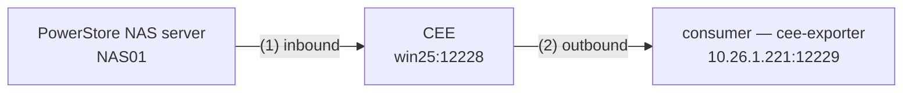

# CEPA, as measured

The working reference for the CEE event path. Everything here has been observed
on real hardware or read out of the vendored CEE binary; where something is
inferred it says so. Dell publishes no protocol specification, so this document
and `cee-partner-allowlist.md` are the specification this repo works from.

Read this to make CEPA work. The dated documents — `cepa-bring-up-findings.md`,
`cee-9-3-windows-bring-up.md`, `cepa-2026-08-22-powerstore-session.md` — are the
historical record of how it was worked out, including the wrong turns. You do
not need them to operate the thing.

## The two legs



**Leg 1, inbound.** The array opens a short-lived TCP session to CEE every
`heartbeat` seconds (default 10), sends two `HEAD /vee` probes and one
`POST /vee`, and closes. Sub-millisecond — a snapshot of established
connections will not see it, use a capture.

**Leg 2, outbound.** CEE connects *out* to the consumer, registers, then
heartbeats it and delivers events.

**Leg 2 gates leg 1.** Until CEE has a registered, online partner it tells the
array it has no CEPA configuration, and the array discards every event it
generates. This is the single most important fact in this document: *a fault
that looks entirely array-side is usually the consumer leg.*

## Leg 1 — what the array sends and CEE answers

```http
POST /vee HTTP/1.1
Host: win25.diab.local:12228
User-Agent: EMC Data Mover
Content-Type: text/xml
Content-Length: 648                       ← UTF-8 from PowerStore

<CheckFileRequest>
<Args action="9" name="<base64 UTF-16LE \\nas01.diab.local\CHECK$>"
      celerraIP="10.26.1.224" sourceID="10" sourceDescr="Trident"
      type="0" protocol="0"/>
<CEPPHeartBeatArgs preEventsMissed="0" postSuccessEventsMissed="0"
                   postFailureEventsMissed="0">
  <CEPPServerList><CEPPServer ip="10.26.1.199"/></CEPPServerList>
  <CIFSServerList><CIFSServer netbios="NAS01" domain="DIAB"
      fqdn="nas01.diab.local" realm="DIAB.LOCAL">…</CIFSServer></CIFSServerList>
</CEPPHeartBeatArgs></CheckFileRequest>
```

`action="9"` is the heartbeat, `action="11"` an event. The `name` attribute is
only string-parsed for a server name — **CEE never opens that share**, measured
by capturing every packet win25 sends to the array.

The reply carries the status the array acts on:

| status | meaning | what it tells you |
|---|---|---|
| `0x0` | NORMAL | working — events will flow |
| `0x1` | `VC_ERROR_SETUP` | CEE has the facility disabled, or the source is not valid/online |
| `0x10` | `VC_ERROR_BAD_REQUEST` | CEE could not build an event context; a *replayed* request lands here |
| `0x12` | OFFLINE | a partner is registered but not answering heartbeats |
| `0x16` | `VC_ERROR_CEPP_NOT_FOUND` | **no registered partner** — almost always leg 2 |

`preEventsMissed` / `postSuccessEventsMissed` / `postFailureEventsMissed` in the
array's own heartbeat are the best progress signal available: they climb while
CEE refuses and sit at zero when it does not.

### The full status vocabulary

The five above are the ones seen on this deployment. The complete `VC_Status`
enum, from `GetVCStatusDescr(VC_Status)` in `libConvert.so` — a dense jump table
over 0x00–0x20, so there is nothing outside this range:

| | | | | | |
|---|---|---|---|---|---|
| `0x00` | `SUCCESS` | `0x0b` | `MACRO_VIRUS` | `0x16` | `ERROR_CEPP_NOT_FOUND` |
| `0x01` | `ERROR_SETUP` | `0x0c` | `OTHER_VIRUS` | `0x17` | `ERROR_CEPP_INTERFACE` |
| `0x02` | `ERROR_AV_NOT_FOUND` | `0x0d` | `ERROR_AVINTERFACE` | `0x18` | `MSRPC_ERROR` |
| `0x03` | `ERROR_FILE_NOT_FOUND` | `0x0e` | `ERROR_SHUTDOWN` | `0x19` | `ERROR_HTTP` |
| `0x04` | `ERROR_ACCESS_DENIED` | `0x0f` | `ERROR_AUTH` | `0x1a` | `ERROR_CEMA_KMIP` |
| `0x05` | `ERROR_FAIL` | `0x10` | `ERROR_BAD_REQUEST` | `0x1b` | `ERROR_CEMA_KMIP_REVOCATION` |
| `0x06` | `ERROR_TIMEOUT` | `0x11` | `ERROR_INSUFFICIENT_RESOURCES` | `0x1c` | `ERROR_CEMA_OTHER` |
| `0x07` | `CHECK_IN_PROGRESS` | `0x12` | `OFFLINE` | `0x1d` | `ERROR_CEMA_NOT_FOUND` |
| `0x08` | `SUSPECT_VIRUS` | `0x13` | `ERROR_CEPP_ACCESS_DENIED` | `0x1e` | `ERROR_CEMA_INTERFACE` |
| `0x09` | `DETECT_VIRUS` | `0x14` | `ERROR_CEPP_DISK_FULL` | `0x1f` | `ERROR_CEMA_LOCKBOX` |
| `0x0a` | `TEST_VIRUS` | `0x15` | `ERROR_CEPP_OTHER` | `0x20` | `ERROR_BAD_PROTOCOL` |

These are CEE's own strings; the `VC_` prefix used above and in Dell's material
is not part of them. `0x12 OFFLINE` and `0x16 ERROR_CEPP_NOT_FOUND` match what
was observed on the wire, which is the check on this decode.

The same binary also settles the facility numbering, from
`GetFacilityIDDescr(FacilityID)`: **0 CAVA, 1 CQM, 2 Audit, 3 Index, 4 CEMA,
5 Backup, 6 CARA, 11 VCAPS, 12 VCAPS+** (7–10 are `Unknown`). Audit is 2 — which
is the number that matters, since it keys the partner allowlist.

## Leg 2 — the five gates

Every one of these must pass, and each fails with its own status on leg 1:

| Gate | Fails as |
|---|---|
| 1 endpoint, 2 identity, 4 encoding | `0x16` — no registered partner. Uninformative on its own, which is why these three are indistinguishable from the array side |
| 3 liveness | `0x12 OFFLINE` — registration succeeded, the heartbeat reply did not |
| 5 event acknowledgement | `0x1` with `auditStatus="0x1"`, while heartbeats keep returning `0x0` |

Gate 5 is the dangerous one. It passes every check on both legs, delivers events
to the consumer, and still publishes nothing.

### Gate 1 — the endpoint must be reachable and correctly formed

```text
HKLM\SOFTWARE\EMC\CEE\CEPP\Audit\Configuration
  Enabled  = 1
  EndPoint = <partner-id>@http://<consumer-host>:<port>
```

The `name@` prefix is mandatory; CEE ignores a bare URL. Order matters in a
semicolon-separated list — CEE monitors the *first* partner to decide whether to
publish at all. `Configuration\Security\Http\ServerEnabled` must be `1`
(CEE 9.2.0.0 ships `0`; 9.3.0.0 ships `1`).

### Gate 2 — the partner identity must be one CEE already knows

**This is the gate that blocked this project for three bring-ups.**

CEE PUTs `<RegisterRequest />` and parses the reply. The reply must be a
`<RegisterResponse>` — an empty body fails with *"Top node is not
RegisterResponse"* — and the identity in it must appear in `CGuidStore`, a table
compiled into `libCEPPAPIWrapper.so` keyed by *(friendlyName, facility)* → GUID.

```xml
<RegisterResponse><EndPoint guid="49f4da0f-055f-401c-9f83-a95ce61447f6"
    friendlyName="PeerSoftwareCollector" version="1.2" desc="…" />
  <Filter protocol="0"><EventTypeFilter value="0xFFFFFFFF0000000000000000" /></Filter>
  <Filter protocol="1"><EventTypeFilter value="0xFFFFFFFF0000000000000000" /></Filter>
</RegisterResponse>
```

Three things must agree: the partner id in `EndPoint`, the `friendlyName` here,
and the `guid`'s pairing for that name **and that facility**. A self-generated
GUID can never work. See `cee-partner-allowlist.md` for all 47 identities.

- unknown name → `Partner error, unknown or invalid GUID`
- known name, wrong GUID → `Partner error. GUID mismatch`
- success → `Register(): Exit rpcStatus: 0, NtStatus: 0`

Protocol codes are `0=CIFS, 1=NFS, 2=FTP, 3=Unknown` (from CEE's `ProtocolDesc`).
The working configuration uses **one `<Filter>` element per protocol**, as the
captured Varonis response does. CEE's own SplunkHEC template uses the comma form
`protocol="0,1"`, so that presumably parses too — but it has never been tested
against a *successful* registration here, so prefer the separate elements.

### Gate 3 — answer the liveness probe

Once registered CEE probes with `<HeartBeatRequest />` and scans the reply for
`hbStatus=` and `ntStatus=`. Reply `hbStatus=0&ntStatus=0`.

`hbStatus` values, read from an indexed pointer table in the binary (not from
string order): `0 ONLINE, 1 OFFLINE, 2 UNREGISTER, 3 REREGISTER, 4 UNKNOWN`.

Miss this and registration succeeds but the array gets `0x12 OFFLINE`.

The separator between the two fields is `&`. This was a guess from the `xml=`
form convention until it was tested against a live array on 2026-08-22: `&`
gives `status="0x0"` on leg-1 heartbeats, and `\n` gives `0x12 OFFLINE` and the
array stops publishing altogether. Do not "tidy" it.

### Gate 4 — encoding

CEE sends `<RegisterRequest />` as **38 bytes of UTF-16LE** to an unrecognised
partner and **19 bytes of UTF-8** once the identity is allowlisted. Mirror the
request's encoding. Answering UTF-16 to a UTF-8 request gives
`PrintRegistration():: Substring guid not found` and silent failure.

OneFS sends UTF-8 and must be answered in UTF-8; PowerStore's own leg-1 traffic
is UTF-8 despite earlier notes to the contrary.

### Gate 5 — acknowledge the event batch with a document

**A bare HTTP 200 is not an acknowledgement.** Answer `<CheckEventRequest>`
with a body:

```xml
<CheckEventResponse status="0x0"/>
```

Miss this and the failure is total, silent, and looks like something else
entirely. CEE reads the empty body as a failed delivery and reports it upstream
as `CheckFileResponse status="0x1"` carrying `<EventResponse auditStatus="0x1"/>`.
The array counts the batch missed and retries **the same event**, so its queue
head never clears and nothing behind it is ever sent. Measured on this estate:
one event from 2026-08-14 redelivered on every heartbeat for eight days, and no
other event ever.

Nothing in the consumer looks wrong while this happens. Registration succeeds,
`<HeartBeatRequest />` is answered and returns `0x0`, events arrive and are
written, and consumer-side counters climb. The only signal is on the array: a
Major alert, `0x01301b03 all_servers_unreachable`, "all the publishing pools of
the NAS server are unavailable" — which reads as a network fault, and is not
one. The NAS was TCP-connected to CEE on 12228 throughout.

Both sides of the comparison, on the wire, 2026-08-22:

| Consumer reply to `<CheckEventRequest>` | Leg 1 | Result |
|---|---|---|
| empty body | `status="0x1"`, `auditStatus="0x1"` | `action="11"` retried 6× in 40 s; one distinct path ever seen |
| `<CheckEventResponse status="0x0"/>` | `status="0x0"` | no retries; backlog flushed — 1780 events, 14 event types, 30 s |

**This document cannot be found in the binaries, and looking for it will
actively mislead you.** There is no `CheckEventResponse` literal in ASCII or
UTF-16 in `CEPPAPIWrapper.dll`, `CEPPFilter.dll`, `EvtCxt.dll`, `Convert.dll` or
`CAVA.exe`. That absence was read once as proof the empty 200 was the whole
contract — it is not proof of anything. CEE matches on the parsed document, not
on a stored template. Only the wire settles this.

Note the asymmetry with gate 3: the heartbeat reply is a urlencoded form
(`hbStatus=0&ntStatus=0`) and the event reply is XML. They are not the same
shape and there is no reason to expect them to be.

## Events

CEE delivers to the consumer as:

```xml
<CheckEventRequest><EventList count="N">
  <Event event="0x8" path="\\nas01.diab.local\CHECK$\FS01\f.txt" flag="0x0"
     server="…" share="…" clientIP="…" serverIP="…" timeStamp="…"
     userSid="…" ownerSid="…" fileSize="0x…" newName="…"
     desiredAccess="0x…" createDispo="0x…" ntStatus="0x…" relativePath="…"
     encodingType="…" encodedPath="…" encodedRelativePath="…" encodedNewName="…"/>
</EventList></CheckEventRequest>
```

Prefer `encodedPath` when present — CEE supplies it exactly when the plain
attribute is lossy.

`event` is a **bitmask**. The full vocabulary, with CEE's own spelling of each
name, read out of `GetEventDescr8(CEPP_EventType)` in `libConvert.so`:

| bit | value | name | | bit | value | name |
|---|---|---|---|---|---|---|
| 0 | `0x1` | `FileOpenNoAccess` | | 10 | `0x400` | `DirRename` |
| 1 | `0x2` | `FileOpenRead` | | 11 | `0x800` | `FileSetACL` |
| 2 | `0x4` | `FileOpenWrite` | | 12 | `0x1000` | `DirSetACL` |
| 3 | `0x8` | `FileCreate` | | 13 | `0x2000` | `DirOpen` |
| 4 | `0x10` | `DirCreate` | | 14 | `0x4000` | `DirClose` |
| 5 | `0x20` | `FileDelete` | | 15 | `0x8000` | `FileRead` |
| 6 | `0x40` | `DirDelete` | | 16 | `0x10000` | `FileWrite` |
| 7 | `0x80` | `FileCloseModified` | | 17 | `0x20000` | `FileSetSecurity` |
| 8 | `0x100` | `FileCloseUnmodified` | | 18 | `0x40000` | `DirSetSecurity` |
| 9 | `0x200` | `FileRename` | | — | `0xFFFFFFFF` | all events |

**19 bits, mask `0x7FFFF`.** `0x0` and any unassigned value render as `Unknown`.

This supersedes the earlier reading of this section, which listed 21 names
against mask `0x1FFFFF` with only bit 3 measured. The correction is small and
mostly reassuring: **the first nineteen were right**, in exactly that order —
only Dell's `OpenFileReadOffline` and `OpenFileWriteOffline` are absent, and CEE
9.2.0.0 has no bits 19 or 20 at all. Bit 3 (`0x8`) resolves to `FileCreate`,
which is the one entry that had been confirmed by capture on real hardware, so
the extraction agrees with the only ground truth there was.

Read it yourself with no host and no array — `libConvert.so` is in the vendored
rpm, and CEE dispatches on this exact table:

```bash
rpm2cpio bin/emc_cee_RHEL-9.2.0.0.x86_64.rpm | bsdtar -xf - ./opt/CEEPack/libConvert.so
llvm-objdump -d --start-address=0xbe40 --stop-address=0xbff0 opt/CEEPack/libConvert.so
```

Values 0–0x20 go through a jump table at `.rodata:0x1420c`; everything above is
a binary-search compare chain, each arm a bare `leaq <name>; retq`. There is a
`wchar_t` twin, `GetEventDescr`, over the same values.

Note this is a *different* numbering from OneFS, whose `NFSEventArgs/@eventType`
is fully resolved in `cee-9-3-windows-bring-up.md`. Do not share one table.

## Diagnosis

### `Debug=63` — the only level that explains a refusal

`Debug`/`Verbose` are a **6-bit mask, not a scale**. Measured by replaying one
captured heartbeat at each level and counting trace lines:

| level | 1 | 2 | 3 | 4 | 5 | 7 | 15 | 31 | **63** | 127 | 255 |
|---|---|---|---|---|---|---|---|---|---|---|---|
| lines | 2 | 5 | 6 | 5 | 6 | 10 | 11 | 11 | **40** | 40 | 40 |

`9` prints *less* than `3`. Three bring-ups concluded "CEE tells you nothing" on
the strength of `Debug=1`. At 63 it prints `ValidateResponse()` naming the exact
reason a partner was refused, and `CheckHeartBeat CEPP Returning … HB Result`.

Values above 63 overflow and are read as 0 — the banner will say `Debug: 0`.

### Where the trace goes

| platform | channel |
|---|---|
| Linux | stdout → journal (`journalctl -u emc_cee`), **block-buffered on a pipe** — run a container with `-it` or you see nothing until it exits |
| Windows | `OutputDebugString` (`DBWIN_BUFFER`), *not* the event log — attach with `dbgcapture.ps1` (see the note below) or Sysinternals DebugView |

On Windows only the Monitor (`[EMC CEEM]`) was observed writing there;
`CAVA.exe` stayed silent even at `Debug=3`. Getting the CEPA trace on Windows
may need whatever Dell KB 000022982 describes. **Debug the protocol on Linux.**

Re-measured at the maximum on 2026-08-22, CEE **9.2.0.0**, Windows Server 2025,
because "the level was too low" is the obvious rebuttal and it is wrong:

- `Debug=63` and `Verbose=63` set on both `HKLM:\SOFTWARE\EMC\CEE\Configuration`
  and `…\Monitor\Configuration` — the only two places either value exists on
  the host — and both services restarted afterwards.
- 150 s of `DBWIN_BUFFER` captured across several heartbeats and event
  deliveries: 14 lines, of which the only CEE ones were two
  `[EMC CEEM]: CEvtLogStore: EntryWritten` from the Monitor. Nothing from CAVA.
- No file appeared either — nothing under `C:\Program Files\EMC`,
  `C:\ProgramData` or `C:\Windows\Temp` was written in the window.
- `CAVA.exe` was the right process and was running the new setting: pid 8872
  owned the listener on 12228 *and* every outbound connection to the consumer,
  with `CEPPAPIWrapper.dll`, `CEPPFilter.dll`, `EvtCxt.dll` and `Convert.dll`
  loaded, started after the registry change.

So the trace table above — the one measured by replaying a heartbeat at each
level — is a **Linux** measurement, and does not transfer. On 9.2.0.0 Windows
there is no level at which CAVA explains itself. The instruction stands
unqualified: debug the protocol on Linux.

### `GET /vee` — CEE's own status document

```http
GET /vee  ->  <CEE version="9.3.0.0"></CEE>
```

`Facility::Instrument()` can populate it with `<CEPAFacility name="…">
<PartnerAttributes … lastHBOnlineTime="…" ONLINE …>`. Empty on every CEE
observed so far, including working ones, so *do not* read an empty document as a
fault — its usefulness is unconfirmed.

### `cepa_probe.sh` and `dbgcapture.ps1`

> **These do not travel with the repository.** They live in
> `state/cepa-evidence-2026-08-22/`, and `.gitignore` excludes `state/*` because
> that directory holds site addresses and packet captures. A fresh clone has
> neither script; ask whoever ran the 2026-08-22 session for a copy, or rebuild
> them from the description here. Do not read "it is in `state/`" as "it is in
> the repo".

`cepa_probe.sh`: one command, ~60 s. Captures on the CEE host and prints CEE's
`status`, the array's missed-event counters, and whether real events arrived.
This is the instrument two bring-ups lacked.

`dbgcapture.ps1`: attaches to the Windows `DBWIN_BUFFER` channel and prints
CEE's `OutputDebugString` trace, which is where the CEPA trace goes on Windows.
Sysinternals DebugView does the same job if you do not have the script.

`pktmon` writes nothing readable until `pktmon stop` flushes it — a running
capture reports `Packets total: 0`, which looks exactly like a dead link.
Read cycle is stop → `etl2pcap` → restart.

## Failure signatures

| What you see | Cause |
|---|---|
| `0x16`, every observable green | No registered partner — gate 2, nearly always the identity |
| `0x16` with a *dead* endpoint too | Expected; a dead endpoint and a rejected registration are indistinguishable. **Not** evidence the consumer leg is innocent |
| `0x12` | Registered but not answering `<HeartBeatRequest />` — gate 3 |
| `0x1` on heartbeats | Facility disabled, or source not valid/online |
| `0x1` + `auditStatus="0x1"` on **events**, heartbeats still `0x0` | Consumer answered the batch with a bare 200 — gate 5. The array retries one event forever and never advances |
| Array alert `0x01301b03 all_servers_unreachable`, but the NAS is TCP-connected to CEE | Gate 5. Not a network fault, despite the wording and the repair advice |
| Exactly one event path, redelivered at the heartbeat interval, forever | Gate 5. The array's queue head cannot clear |
| `0x10` | You are replaying a captured request; it never reaches the CEPP lookup |
| `Substring guid not found` | Encoding mismatch — gate 4 |
| `server [NAS01] event not allowed` | AccessList holds addresses; it matches **FQDNs** |
| Empty packet capture | Wrong `http_port` on the publisher, or the pool names a different host |
| CEE re-sends `<RegisterRequest />` every 10 s | Normal. Identical against a valid, an empty and a malformed reply — **not a signal** |
| Nothing in `/opt/CEEPack/logs/` | Normal. CEE 9.2.0.0 writes no log file on any platform |

## Things that are true but easy to get wrong

- **`postSuccessEventsMissed` climbing means the array is healthy**, generating
  events, and being refused. It is a *good* sign when you are debugging CEE.
- **`Get-NetTCPConnection` cannot see the array's sessions.** They are
  sub-millisecond. Use a capture.
- **A replayed heartbeat is not array traffic.** It is answered `0x10` before
  CEE reaches the CEPP lookup. This trap has been hit twice.
- **PowerStore requires Microsoft RPC in its transport list and it cannot be
  unticked**, so a Linux host is disqualified as a *direct* CEPA target — the
  array skips it without opening a session. CEE cannot be bypassed for
  PowerStore. OneFS has no such constraint and speaks CEPA directly.
- **SMB must be enabled on the NAS server** even for NFS-only auditing; an
  NFS-only NAS server cannot have Events Publishing enabled at all
  (Dell KB 000060271).

## Sources

- `bin/emc_cee_RHEL-9.2.0.0.x86_64.rpm` — the reference of record.
  `libCEPPFilter.so` (`CEndPoint::Init()`, the `EVENT_*` vocabulary,
  `ProtocolDesc`), `libCEPPAPIWrapper.so` (`CGuidStore`, `CBaseClient::
  ValidateResponse()`, the `RegisterResponse` template, `<CheckEventRequest>`),
  `libCEECore.so` (`CheckHeartBeat`, the facility instrumentation).
- Dell KB 000194250 (Unity `ERROR_CEPP_NOT_FOUND`, and the 21-name event list
  with mask `0x1fffff`), 000052027 (VNX, same error), 000049515 (Varonis — the
  only published `RegisterResponse` from a shipping consumer), 000060271
  (NFS-only NAS servers).
- *Using the Common Event Enabler on Windows Platforms* 9.x rev 24.
- Peer Software's PowerStore configuration guide — confirms the
  `name@http://host:port` endpoint form against PowerStore over HTTP.
