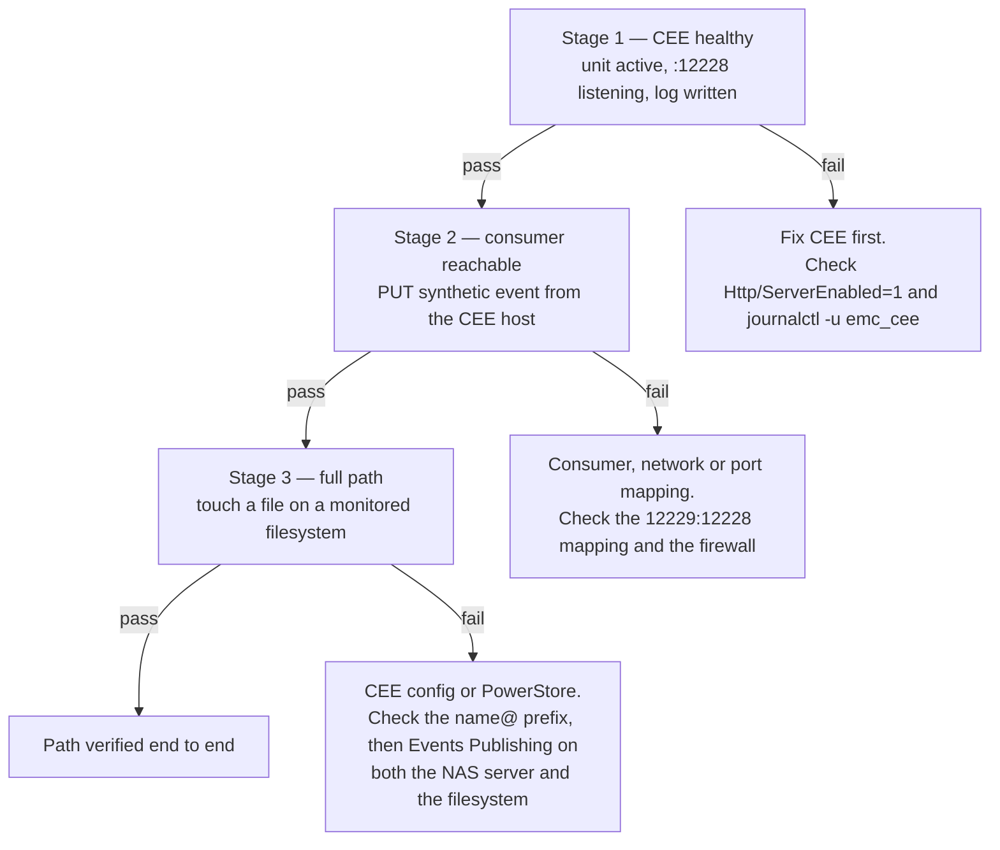

# PowerStore Events Publishing — Setup Runbook

Manual procedure. The `dellemc.powerstore` Ansible collection has 46
modules and none covers Events Publishing, CEPA, or publishing pools, so
automating this needs raw REST calls against a path that must be
introspected from a live array. That is deferred.

Complete `docs/ansible-deployment.md` first — CEE must be running and
listening before PowerStore has anywhere to publish to.

## Prerequisites

- PowerStoreOS 4.1 or later
- CEE 9.2 or later, deployed and verified
- Time synchronised across the array, the CEE host, and the consumer host
- SMB configured on the NAS server; NFS optional
- TCP 12228 open from the array to the CEE host

## Procedure

Perform these in order. Each step depends on the previous one.

1. **Enable Events Publishing on the NAS server.**
   Navigate to the NAS server, then *Security & Events* → *Events
   Publishing*. Enable it.

2. **Create an Events Publisher**, or modify the existing one.

3. **Create a Publishing Pool.** Add the CEE host's IP address or FQDN to
   the *Event Publishing (CEPA) Server* list.

4. **Select Post-Events.** Select all, then uncheck these five:
   - `CloseDir`
   - `OpenDir`
   - `FileRead`
   - `OpenFileReadOffline`
   - `OpenFileWriteOffline`

5. **Leave Pre-Events and Post-Error-Events unchecked.** Pre-events are
   synchronous and block the client until the consumer answers; the audit
   path does not need them.

6. **Enable monitoring per filesystem.** For each filesystem to monitor:
   select it, open the *Security & Events* tab, enable Events Publishing,
   select the protocols (SMB, NFS, or both), and apply.

## Verification

Three stages, in order. Each isolates one leg, so a failure tells you
which side is broken rather than only that something is.

### Stage 1 — CEE is healthy

Already asserted by the `cee_verify` role at the end of the playbook run.
To recheck by hand on the CEE host:

    systemctl is-active emc_cee
    ss -lntp | grep 12228
    tail -n 50 /opt/CEEPack/logs/*.log

Expected: `active`, a listener on 12228, and a log with no
`Platform is not supported`.

### Stage 2 — the consumer is reachable and parsing

Run this **from the CEE host**, not from your workstation. The point is to
prove that the exact path CEE will use — that host, that address, that
port — reaches a working consumer.

Record cee-exporter's current event count:

    curl -s http://<docker-host>:9228/metrics | grep '^cee_events_received_total'

Send a synthetic event. cee-exporter accepts `PUT` on `/` with a CEPA XML
body; `POST` is rejected:

    curl -s -o /dev/null -w '%{http_code}\n' -X PUT \
      -H 'Content-Type: text/xml' \
      --data-binary '<?xml version="1.0" encoding="utf-8"?>
    <CEEEvent>
      <EventType>CreateFile</EventType>
      <Timestamp>2026-08-08T12:00:00Z</Timestamp>
      <FilePath>/runbook/stage2-probe.txt</FilePath>
      <Username>runbook</Username>
      <Domain>TEST</Domain>
      <ClientAddress>10.10.10.20</ClientAddress>
    </CEEEvent>' \
      http://<docker-host>:12229/

Expected: HTTP `200`. Then read the counter again:

    curl -s http://<docker-host>:9228/metrics | grep '^cee_events_received_total'

Expected: the counter increased by one, and the event appears in
cee-exporter's output.

**What this does and does not prove.** It proves the consumer is running,
reachable from the CEE host at the address CEE is configured to use, and
parsing CEPA XML. It does *not* exercise CEE's own forwarding, because
CEE's inbound source API is the interface PowerStore speaks and there is
no documented way to inject a synthetic event into it. That leg is
exercised by Stage 3.

The isolation is still worth having: if Stage 2 passes from the CEE host
and Stage 3 fails, the consumer, the network path and the port mapping
are all ruled out, leaving CEE's configuration or the PowerStore side.
If Stage 2 fails, stop — there is no point configuring PowerStore until
the consumer answers.

Common Stage 2 failures:

- Connection refused → the `12229:12228` mapping is missing from
  `docker-compose.test.yml`, or a firewall on the Docker host blocks it.
- HTTP 405 → the request used `POST`. cee-exporter requires `PUT`.
- HTTP 200 but no counter movement → the XML did not parse; check
  cee-exporter's log.

### Stage 3 — the PowerStore → CEE leg

On a client with the monitored filesystem mounted, create and delete a
file:

    touch /mnt/<share>/cee-runbook-test.txt
    rm /mnt/<share>/cee-runbook-test.txt

Expected: corresponding `CreateFile` and `DeleteFile` events appear in
cee-exporter's output (`/var/log/cee-exporter/audit.evtx` in the test
stack) within a few seconds.

If Stage 2 passed and Stage 3 did not, the problem is on the PowerStore
side: recheck that Events Publishing is enabled on both the NAS server
*and* the individual filesystem, that the protocol selection matches how
the client mounted, and that the CEE host address in the publishing pool
is correct.

## Notes

- Port 12228 is CEE's **inbound** port — where PowerStore posts events.
  It is distinct from `<EndPoint>`, the **outbound** hop to the consumer.
  Both legs can use 12228 when they are on different hosts; in this
  repo's test stack the consumer is published on 12229 so the CEE host
  and the Docker host may be the same machine.
- Do not use a loopback address in `<EndPoint>` even when CEE and the
  consumer are co-hosted. The Peer Software guide forbids it.
