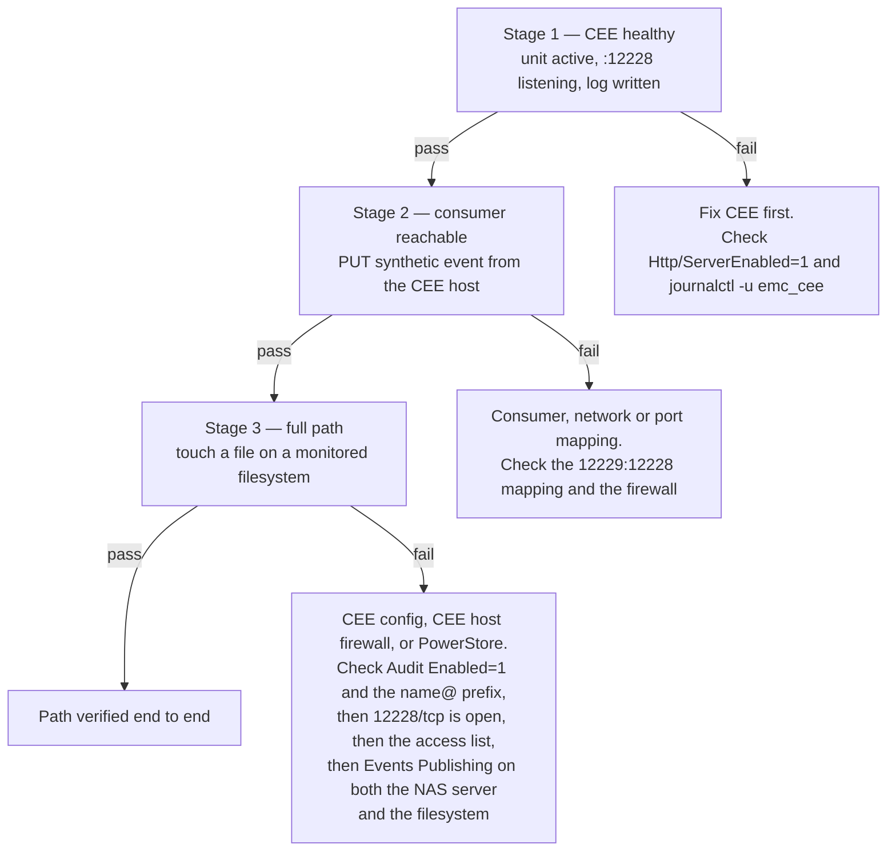

# PowerStore Events Publishing — Setup Runbook

Manual procedure. The `dellemc.powerstore` Ansible collection has 46
modules and none covers Events Publishing, CEPA, or publishing pools, so
automating this needs raw REST calls against a path that must be
introspected from a live array. That is deferred.

Complete `docs/ansible-deployment.md` first — CEE must be running and
listening before PowerStore has anywhere to publish to.

If this is the first time this procedure has been carried out against a
real array, run it inside the plan in `docs/acceptance-tests.md`, which
covers what a passing stage does and does not prove. Stages 1–3 below are
AT-8, AT-10 and AT-11 there.

## Prerequisites

- PowerStoreOS 4.1 or later
- CEE 9.2 or later, deployed and verified
- Time synchronised across the array, the CEE host, and the consumer host
- SMB configured on the NAS server; NFS optional. Not a preference — an
  NFS-only NAS server cannot have Events Publishing enabled at all (Dell KB
  000060271). A standalone SMB server with no shares satisfies it; see
  `cepa-bring-up-findings.md` for the multiprotocol DNS consequence.
- TCP 12228 open from the array to the CEE host — including **on the CEE
  host's own firewall**. RHEL 9 ships firewalld enabled with only ssh
  allowed; the Ansible playbook opens the port when `cee_manage_firewall`
  is true, but confirm it with `firewall-cmd --list-ports` before
  configuring the array. Nothing in Stage 1 detects a closed port, because
  it probes loopback.

## Procedure

Perform these in order. Each step depends on the previous one.

1. **Enable Events Publishing on the NAS server.**
   Navigate to the NAS server, then *Security & Events* → *Events
   Publishing*. Enable it.

2. **Create an Events Publisher**, or modify the existing one.

3. **Create a Publishing Pool.** Add the CEE host's IP address or FQDN to
   the *Event Publishing (CEPA) Server* list.

4. **Select Post-Events.** Select all, then uncheck these five:
   - `CloseDir`
   - `OpenDir`
   - `FileRead`
   - `OpenFileReadOffline`
   - `OpenFileWriteOffline`

5. **Leave Pre-Events and Post-Error-Events unchecked.** Pre-events are
   synchronous and block the client until the consumer answers; the audit
   path does not need them.

6. **Enable monitoring per filesystem.** For each filesystem to monitor:
   select it, open the *Security & Events* tab, enable Events Publishing,
   select the protocols (SMB, NFS, or both), and apply.

## Verification

Three stages, in order. Each isolates one leg, so a failure tells you
which side is broken rather than only that something is.

### Stage 1 — CEE is healthy

Already asserted by the `cee_verify` role at the end of the playbook run.
To recheck by hand on the CEE host:

    systemctl is-active emc_cee
    ss -lntp | grep 12228
    journalctl -u emc_cee -n 50

Expected: `active`, a listener on 12228, and no `Platform is not
supported` in the journal output. CEE 9.2.0.0 writes no log file on
Linux — its entire output goes to stdout, which systemd captures into
the journal — so `journalctl -u emc_cee`, not a file under
`/opt/CEEPack/logs/`, is the only place to see it.

### Stage 2 — the consumer is reachable and parsing

Before the stack is started for the first time, the exporter's output
directory must exist and be owned by uid 65532 — the image runs as that
non-root user, and its evtx writer opens the file eagerly at startup, so a
root-owned directory (which is what Docker creates for a bind mount whose
source is missing) makes the container exit 1 with `writer_init_failed`
and crash-loop. On the Docker host, in the repo root:

    mkdir -p logs/cee-exporter && sudo chown 65532:65532 logs/cee-exporter

Fix the ownership rather than adding `user: "0:0"` to the service —
running non-root is deliberate hardening upstream, not an accident. If
Stage 2 fails at every check at once, confirm the container is actually up
(`docker compose -f docker-compose.test.yml ps`) before debugging the
network.

Run the rest **from the CEE host**, not from your workstation. The point is
to prove that the exact path CEE will use — that host, that address, that
port — reaches a working consumer.

Record cee-exporter's current event count:

    curl -s http://<docker-host>:9228/metrics | grep '^cee_events_received_total'

Send a synthetic event. cee-exporter accepts `PUT` on `/` with a CEPA XML
body; `POST` is rejected:

    curl -s -o /dev/null -w '%{http_code}\n' -X PUT \
      -H 'Content-Type: text/xml' \
      --data-binary '<?xml version="1.0" encoding="utf-8"?>
    <CEEEvent>
      <EventType>CEPP_CREATE_FILE</EventType>
      <Timestamp>2026-08-08T12:00:00Z</Timestamp>
      <FilePath>/runbook/stage2-probe.txt</FilePath>
      <Username>runbook</Username>
      <Domain>TEST</Domain>
      <ClientAddress>10.10.10.20</ClientAddress>
    </CEEEvent>' \
      http://<docker-host>:12229/

Expected: HTTP `200`. Then read the counter again:

    curl -s http://<docker-host>:9228/metrics | grep '^cee_events_received_total'

Expected: the counter increased by one, and the event appears in
cee-exporter's output.

**What this does and does not prove.** It proves the consumer is running,
reachable from the CEE host at the address CEE is configured to use, and
parsing CEPA XML. It does *not* exercise CEE's own forwarding, because
CEE's inbound source API is the interface PowerStore speaks and there is
no documented way to inject a synthetic event into it. That leg is
exercised by Stage 3.

The isolation is still worth having: if Stage 2 passes from the CEE host
and Stage 3 fails, the consumer, the network path and the port mapping
are all ruled out, leaving CEE's configuration or the PowerStore side.
If Stage 2 fails, stop — there is no point configuring PowerStore until
the consumer answers.

Common Stage 2 failures:

- Connection refused → the `12229:12228` mapping is missing from
  `docker-compose.test.yml`, or a firewall on the Docker host blocks it.
- HTTP 405 → the request used `POST`. cee-exporter requires `PUT`.
- HTTP 200 but no counter movement → the XML did not parse; check
  cee-exporter's log.

### Stage 3 — the PowerStore → CEE leg

On a client with the monitored filesystem mounted, create and delete a
file:

    touch /mnt/<share>/cee-runbook-$(date +%s).txt
    rm /mnt/<share>/cee-runbook-*.txt

Use a filename that could not have come from anywhere else, and note it —
both checks below match on it.

Check the cheap one first. cee-exporter logs every parsed event before
enqueuing it, and `cee-exporter-config.toml` already sets
`logging.level = "debug"`, so this works out of the box:

    docker compose -f docker-compose.test.yml logs cee-exporter \
      | grep cepa_event_detail | grep cee-runbook-

Expected: one line with `event_type=CEPP_CREATE_FILE` and one with
`event_type=CEPP_DELETE_FILE`, each carrying your filename in `file_path`.
This proves CEE forwarded and cee-exporter parsed — but not that anything
was written.

Then check the output file (`/var/log/cee-exporter/audit.evtx` in the test
stack). Do **not** grep it for `CreateFile` or `DeleteFile`: those strings
never appear. cee-exporter converts CEPA event types to numeric Windows
EventIDs and does not write the CEPA type into the record at all. Match on
the EventID together with `ObjectName`:

| Client action | CEPA event type | EventID in the evtx |
|---|---|---|
| create | `CEPP_CREATE_FILE` | 4663 |
| delete | `CEPP_DELETE_FILE` | 4660 |

Expected: an EventID 4663 record and an EventID 4660 record, both with
`ObjectName` equal to your test filename, within a few seconds. EventID
alone is not enough — 4663 is also the exporter's default for any event
type it does not recognise, so a 4663 without your `ObjectName` tells you
nothing.

Restarting cee-exporter truncates `audit.evtx` — the writer opens it with
`O_TRUNC`, so every prior record is destroyed. An empty or short file
right after a restart is expected behaviour, not evidence that events
stopped arriving. Re-run the client action after the restart before
concluding anything from an empty file.

If Stage 2 passed and Stage 3 did not, the fault is in CEE's own
configuration or on the inbound leg — PowerStore to CEE. Stage 2 rules out
the consumer, the network path to it and the port mapping, but it does not
exercise CEE's config at all, because it bypasses CEE entirely.

**First, make CEE talk.** Past the startup banner, CEE 9.2.0.0 logs nothing
per request at the shipped `Debug=0`/`Verbose=0` — not even for a *successful*
exchange, confirmed by capturing a healthy heartbeat on the wire and finding
`-- No entries --` across that exact window. A quiet journal is therefore not
evidence that nothing arrived, and every check below is read blind without
this. In `group_vars/all.yml`, in one edit:

    cee_debug: 1
    cee_verbose: 1
    cee_access_list_enabled: 0      # see step 3

then `ansible-playbook site.yml` once. Doing this first rather than partway
down the list matters: the re-run rewrites `emc_cee_config.xml` and restarts
the service, which invalidates anything already read from either.

Set `cee_debug` and `cee_verbose` back to 0 when the diagnosis closes — debug
logging is not a steady-state setting. Leave `cee_access_list_enabled` at 0:
restoring it to 1 with an address-based list restores the failure in step 3.
It is not a diagnostic setting to be undone, and it stays off until someone
tests the server-name form. Because that leaves CEE accepting posts from
anything that can reach 12228, restrict the port by source rather than
opening it broadly — `cee_manage_firewall` opens 12228 to any source, so a
source-scoped firewalld rich rule or an upstream network ACL naming the array
addresses is what actually replaces the access list here.

Read CEE's own output anchored to the restart, so nothing from before it can
be mistaken for a result, and with heartbeats filtered out — at a 10s
interval they will otherwise be all you see:

    journalctl -u emc_cee \
      --since "$(systemctl show -p ActiveEnterTimestamp --value emc_cee)" \
      | grep -vE 'DispatchEvent\(\): .*CEPP_HEARTBEAT request'

Filter the *successful* heartbeats specifically, not every line matching
`HEARTBEAT`. The access-list rejection in step 3 is itself a heartbeat line
(`BAD CEPP_HEARTBEAT request ... event not allowed`), so the broader filter
would hide the failure this section exists to find.

Then check in this order, cheapest first:

1. **CEE's rendered configuration.** On the CEE host, read what the
   playbook actually wrote:

       grep -A3 '<Audit>' /opt/CEEPack/emc_cee_config.xml

   Expected: `<Enabled>1</Enabled>` inside `<Audit>`, and an `<EndPoint>`
   of the form `name@http://host:port` —
   `ceeexporter@http://10.10.10.10:12229` for the test stack.

   `<Enabled>0</Enabled>` means the Audit sub-facility is off and CEE
   forwards nothing whatever PowerStore sends. A bare URL with no `name@`
   prefix is the harder one to spot: CEE accepts the file, starts
   normally, and silently ignores the entry, so Stage 1 and Stage 2 both
   still pass. Either is a `cee_facilities` or `cee_endpoints` edit in
   `group_vars/all.yml` and a playbook re-run.

2. **The CEE host's firewall.** On the CEE host:

       firewall-cmd --list-ports
       firewall-cmd --state

   Expected: `12228/tcp` present, state `running`. A stock RHEL 9 host
   blocks the port, and *every check in Stage 1 still passes* because
   `cee_verify` and `ss -lntp` both look at the local socket, which
   firewalld does not filter. This is the single most likely cause of a
   Stage 3 failure that follows a clean Stage 1 and Stage 2.

   Confirm reachability from off-host rather than trusting the rule list —
   from any machine on the array's side of the network:

       nc -vz <cee-host> 12228

3. **CEE's access list.** `AccessListEnabled` is 1 by default. Measured on
   real arrays: with the list populated by **IP address**, CEE refuses every
   array's heartbeat outright, naming the *server name* rather than the
   source address —

       CTransport+::ValidateArgs(): PowerStore BAD CEPP_HEARTBEAT request (server [NAS01] event not allowed)

   — even though the address that heartbeat came from was on the list. The
   array reports this as a setup failure and never publishes at all:
   PowerStore raises `0x01301b03 all publishing pools unavailable`, OneFS
   logs `vcstatus 0x1: VC_ERROR_SETUP`. Setting `cee_access_list_enabled: 0`
   clears it immediately — which is why it is in the preamble edit above.
   See `cepa-bring-up-findings.md`, including the caveat that this removes a
   real access control, leaving the firewall as the only gate.

4. **The PowerStore side.** Recheck that Events Publishing is enabled on
   both the NAS server *and* the individual filesystem, that the protocol
   selection matches how the client mounted, and that the CEE host address
   in the publishing pool is correct.

## Notes

- Port 12228 is CEE's **inbound** port — where PowerStore posts events.
  It is distinct from `<EndPoint>`, the **outbound** hop to the consumer.
  Both legs can use 12228 when they are on different hosts; in this
  repo's test stack the consumer is published on 12229 so the CEE host
  and the Docker host may be the same machine.
- Do not use a loopback address in `<EndPoint>` even when CEE and the
  consumer are co-hosted. The Peer Software guide forbids it.
