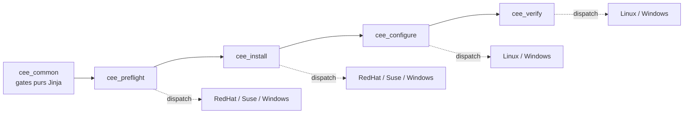

# Design — CEE multiplateforme : RHEL, SLES, Windows

Date : 2026-08-10
Statut : validé, non implémenté

## Objectif

Étendre le déploiement Ansible de Dell Common Event Enabler 9.2.0.0, aujourd'hui
limité à RHEL 9, à deux plateformes supplémentaires : SUSE Linux Enterprise
Server et Windows Server. Le chemin Ansible reste le chemin supporté ; le
conteneur reste un bac à sable de laboratoire et n'est pas concerné.

## Constats établis

Les décisions de ce design reposent sur l'inspection des artefacts vendeur, pas
sur la documentation.

### Les rpm RHEL et SLES livrent le même produit

Comparaison des charges utiles de `emc_cee_RHEL-9.2.0.0.x86_64.rpm` et
`emc_cee_SLES-9.2.0.0.x86_64.rpm` : listes de fichiers identiques. Les 57
entrées supplémentaires côté RHEL sont des liens durs dupliqués et
`/usr/lib/.build-id/*`, c'est-à-dire des métadonnées RPM, pas du contenu.

Les deux livrent :

- `/opt/CEEPack/` avec `emc_cee.exe`, `emc_cee_svc`, `ceeconfig.exe`,
  `emc_cee_config.xml`
- `/etc/systemd/system/emc_cee.service`, `WorkingDirectory=/opt/CEEPack`,
  `User=ceesvc`, `Group=ceesvc`

Conséquence : **`cee_configure` et `cee_verify` fonctionnent sur SLES sans
modification.** Même fichier de configuration, même unité systemd, même port,
même gate `audit`, même sonde loopback.

### Le contrôle de plateforme du build SLES est élargi, pas déplacé

Chaînes présentes dans les binaires SLES :

```
/etc/os-release
/etc/redhat-release
/etc/SuSE-release
SLES
Red Hat Enterprise Linux
Platform is not supported / qualified. CEE will now terminate.
```

Le build SLES accepte les chaînes Red Hat **et** SLES. Le message fatal est
identique à celui du build RHEL, donc le contrôle de log de `cee_verify` reste
valable mot pour mot.

### SLES n'a besoin d'aucun dépôt supplémentaire

Dépendances externes des deux rpm : identiques à `/bin/bash` contre
`/usr/bin/bash` près. Les bibliothèques lourdes — boost 1.88, openssl 3,
libcurl 4, jansson 4 — sont embarquées dans `/opt/CEEPack`. La surface externe
réelle se limite à glibc, `ld-linux` et un shell, tous présents sur un SLES 15
de base.

Le mécanisme `ubi.repo` + `enablerepo` reste donc strictement spécifique à RHEL.

### Windows se configure par le registre

Sur Windows, CEE se configure via le registre sous `HKLM` (entrée `HttpPort`,
activation du serveur HTTP, AccessList), pas via `emc_cee_config.xml`. Le
template `emc_cee_config.xml.j2` ne traverse pas.

### L'installeur Windows est un InstallShield

`EMC_CEE_Pack_x64_9_2_0_0.exe` : PE32, « Setup Launcher Unicode » Flexera
InstallShield 27.0.122, `ProductName = EMC Common Event Enabler 9.2.0.0`,
`OriginalFilename = setup.exe`.

Ce n'est pas un MSI nu. `ansible.windows.win_package` exigera `product_id` et
`arguments` explicites ; il ne peut les déduire seul.

### Les ISO ne contiennent que des installeurs Windows

`EMC_CEE_Pack_9_2_0_0.iso` et `EMC_CEE_Pack_9_2_2_0.iso` contiennent chacune
deux fichiers : l'installeur Win32 et l'installeur x64 de la version
correspondante. Aucun rpm. L'ISO 9.2.0.0 fournit un exe Windows en 9.2.0.0,
soit la même version que les rpm RHEL et SLES.

## Architecture

Cinq rôles. `cee_common` naît de l'extraction des gates neutres.



### Rôle `cee_common`

Reçoit, déplacés sans réécriture :

| Fichier | Origine |
|---|---|
| `assert_required_vars.yml` | `cee_preflight` |
| `validate_endpoints.yml` | `cee_configure` |
| `assert_facilities.yml` | `cee_configure` |

Ces trois fichiers n'opèrent que sur des variables, en Jinja pur, sans aucun
appel de module dépendant de la plateforme. Ils constituent le noyau partagé
des trois OS.

C'est là que vit la logique subtile — ordre des endpoints, port entier non
quoté, `audit` seul, interdiction du loopback — et elle n'est dupliquée nulle
part.

Effet recherché du déplacement : la validation des endpoints et des
sub-facilities remonte **avant** l'installation au lieu d'après. Le commentaire
en tête de `validate_endpoints.yml` affirme déjà « enforced before anything is
written to the target host » ; sa position dans `cee_configure` ne tenait cette
promesse qu'imparfaitement.

Coût du déplacement : les cinq playbooks de `ansible/tests/` incluent ces
fichiers par chemin relatif. Dix-huit lignes d'include à mettre à jour.

### Dispatch

Forme unique, dans le `main.yml` de chaque rôle. Le dispatch est précédé d'un
gate qui refuse nommément une famille non prévue :

```yaml
- name: The OS family must be one this playbook supports
  ansible.builtin.assert:
    that:
      - ansible_os_family in ['RedHat', 'Suse', 'Windows']
    fail_msg: >-
      ansible_os_family is '{{ ansible_os_family }}'. …

- name: Run the platform-specific tasks
  ansible.builtin.include_tasks: "{{ ansible_os_family }}.yml"
```

Sans ce gate, un hôte Debian produirait un échec `include_tasks` sur fichier
introuvable — une erreur générique qui ne nomme pas le vrai problème, contraire
à la discipline du dépôt.

- `cee_preflight` et `cee_install` dispatchent à trois :
  `RedHat.yml`, `Suse.yml`, `Windows.yml`.
- `cee_configure` et `cee_verify` dispatchent à deux : `Linux.yml`,
  `Windows.yml`, puisque RHEL et SLES y sont prouvés identiques. Leur dispatch
  mappe donc `RedHat` et `Suse` vers `Linux.yml`.

**Le dispatch se fait sur `ansible_os_family`, les gates plateforme sur
`ansible_distribution`.** Cette asymétrie est voulue : Rocky et AlmaLinux ont
`ansible_os_family == 'RedHat'` et seront donc dirigés vers `RedHat.yml`, où le
contrôle strict `ansible_distribution == 'RedHat'` les rejette en nommant la
raison. Le dispatch route ; le gate juge.

### Playbook et inventaire

`site.yml` reste **un seul play** sur le groupe `cee`, avec `cee_common` ajouté
en tête des rôles. Aucun mot-clé de niveau play n'est spécifique à un OS, et les
variables de connexion Windows vivent en `group_vars`.

L'inventaire gagne deux groupes enfants, `cee_linux` et `cee_windows`, dont
l'unique rôle est de porter les variables de connexion. Côté Windows :
`ansible_connection: ssh`, `ansible_shell_type: powershell`.

Cible Windows : Windows Server joint à un domaine, piloté par **OpenSSH**, pas
WinRM. Pas de délégation Kerberos par cette voie — sans conséquence ici,
l'installeur étant copié sur l'hôte avant exécution.

## Variables

Restent dans `group_vars/all.yml`, neutres car ce sont des valeurs de
configuration CEE et non des chemins système :

`cee_endpoints`, `cee_http_port`, `cee_https_port`, `cee_facilities`,
`cee_access_list_enabled`, `cee_access_list`, `cee_cache_size`, `cee_threads`,
`cee_debug`, `cee_verbose`, `cee_manage_firewall`.

Descend en `group_vars/cee_linux.yml` et `group_vars/cee_windows.yml`, avec
leurs `.example` respectifs :

`cee_log_path` — `/opt/CEEPack/logs/` n'a aucun sens sur Windows.

`all.yml.example` perd cette ligne.

`cee_manage_firewall` **conserve son nom**. Il exprime une intention, pas un
outil ; seule l'implémentation dessous change (firewalld ou
`ansible.windows.win_firewall_rule`). Ne pas le renommer `cee_manage_firewalld`.

## Détail par rôle

### `cee_preflight`

Le gate plateforme devient une liste blanche par OS :

| Fichier | Accepté |
|---|---|
| `RedHat.yml` | `ansible_distribution == 'RedHat'`, majeure `9` — inchangé |
| `Suse.yml` | `ansible_os_family == 'Suse'`, majeure `15` |
| `Windows.yml` | Windows Server ; une édition client est refusée |

Le reste de `preflight` diverge davantage que la seule question de la
distribution : `chronyc` et `ansible.builtin.wait_for` sont des modules POSIX
exécutés côté cible en Python, et un Windows Server n'a pas d'interpréteur
Python. La totalité du corps de `main.yml` passe donc en fichiers par OS :

- synchronisation horloge : `chronyc tracking` sur Linux,
  `w32tm /query /status` sur Windows
- sonde de port : `wait_for` sur Linux, `ansible.windows.win_wait_for` sur
  Windows

`main.yml` ne conserve que l'include de `cee_common` et le dispatch.

**Règle générale** : aucun module `ansible.builtin.*` de famille POSIX ne
survit dans une branche Windows. `stat` → `win_stat`, `copy` → `win_copy`,
`file` → `win_file`, `find` → `win_find`, `systemd_service` → `win_service`.

### `cee_install`

**`RedHat.yml`** — le contenu actuel de `main.yml`, déplacé sans modification,
y compris le bloc `ubi.repo` et le commentaire justifiant l'absence de
`disable_gpg_check`.

**`Suse.yml`** — glob `emc_cee_SLES-*.x86_64.rpm`, copie sur la cible,
`community.general.zypper`. Pas de bloc dépôts. Le raisonnement
anti-`disable_gpg_check` s'applique identiquement au module zypper et doit être
recopié explicitement, non sous-entendu.

Le glob se terminant par `.x86_64.rpm`, la variante `i386` présente dans `bin/`
ne peut pas matcher : la règle « exactement un rpm » tient sans exclusion
supplémentaire.

**`Windows.yml`** — `win_copy` de l'installeur puis `ansible.windows.win_package`
avec `product_id` et `arguments` explicites.

### `cee_configure`

**`Linux.yml`** — le contenu actuel, déplacé sans modification. Couvre RHEL et
SLES.

**`Windows.yml`** — tâches `ansible.windows.win_regedit` sous `HKLM` en
remplacement du template XML ; `win_firewall_rule` en remplacement du bloc
firewalld ; `win_service` en remplacement de `systemd_service`.

La logique de garde autour du pare-feu se transpose mot pour mot : le pare-feu
Windows ne filtre pas davantage le loopback que firewalld, donc un hôte
pare-feuté passe tous les contrôles tout en rejetant chaque événement réel. Le
chemin où `cee_manage_firewall` vaut faux doit rester aussi bruyant que sur
Linux.

### `cee_verify`

**`Linux.yml`** — le contenu actuel, déplacé sans modification.

**`Windows.yml`** — même séquence de quatre contrôles : service démarré, port en
écoute, log écrit, absence de la ligne fatale. La chaîne
`Platform is not supported / qualified. CEE will now terminate.` est vérifiée
comme étant celle du produit.

## Collections

`ansible/requirements.yml` gagne deux entrées :

| Collection | Usage |
|---|---|
| `ansible.posix` | `firewalld` — existant |
| `community.general` | `zypper` |
| `ansible.windows` | `win_*` |

Comme pour `ansible.posix` aujourd'hui, leur absence casse `--syntax-check` et
`ansible-lint`, pas seulement le déploiement. La documentation existante le dit
déjà pour `ansible.posix` ; la même phrase doit couvrir les trois.

## Artefacts

État cible de `bin/` :

| Fichier | Taille | Version |
|---|---|---|
| `emc_cee_RHEL-9.2.0.0.x86_64.rpm` | 4,1 Mo | 9.2.0.0 |
| `emc_cee_SLES-9.2.0.0.x86_64.rpm` | 3,9 Mo | 9.2.0.0 |
| `EMC_CEE_Pack_x64_9_2_0_0.exe` | 91,5 Mo | 9.2.0.0 |

L'exe est extrait de `EMC_CEE_Pack_9_2_0_0.iso`.

Retirés du dépôt :

- les deux ISO — 343 Mo d'emballage autour d'un seul fichier utile
- `EMC_CEE_Pack_x64_9_3_0_0.exe` — release distincte, issue d'aucune des deux
  ISO, qui casserait l'alignement de version
- les variantes 32 bits (`emc_cee_SLES-*.i386.rpm`, `EMC_CEE_Pack_Win32_*.exe`)
  — aucune cible x86 32 bits réelle pour un consommateur d'événements PowerStore

Les trois plateformes sont alignées sur 9.2.0.0 exactement, donc le versionnage
du dépôt (`vX.Y.Z.W`, calqué sur la release CEE) continue de fonctionner sans
exception à documenter.

### Git LFS

`.gitattributes` traquant `bin/*.rpm` et `bin/*.exe`.

`git lfs track` ne s'applique qu'aux commits futurs. Le rpm RHEL est déjà un
blob Git ordinaire dans l'historique et le resterait, sauf à lancer
`git lfs migrate`, qui réécrit l'historique. À 4 Mo, la réécriture n'est pas
justifiée : LFS s'applique à partir de maintenant, l'historique n'est pas
touché.

## Tests

`ansible/tests/run.sh` passe de cinq à sept playbooks.

Existants, avec chemins d'include mis à jour vers `cee_common` :

- `test_required_vars.yml`
- `test_endpoint_validation.yml`
- `test_facility_gate.yml`
- `test_template_render.yml`
- `test_platform_assertions.yml`

Étendus ou ajoutés :

- `test_platform_assertions.yml` couvre SLES 15 accepté et Windows Server
  accepté ; une édition Windows client est refusée
- un test négatif par nouveau gate plateforme

L'ensemble reste exécutable sur localhost, sans VM ni réseau — ce qui n'est
possible que parce que les gates partagés sont du Jinja pur. C'est une propriété
à préserver : tout gate futur doit rester dans `cee_common` s'il ne dépend pas
de la plateforme.

Chaque nouveau test négatif passe par la mutation-test maison : garde
désactivée, test observé en échec, garde restaurée. Convention existante du
dépôt, étendue aux nouveaux tests.

## Documentation

- `CLAUDE.md` — dit « RHEL 9 » partout ; doit décrire trois plateformes, la
  découpe `cee_common`, et le fait que RHEL et SLES partagent `cee_configure` et
  `cee_verify`
- `docs/ansible-deployment.md` — sections SLES et Windows, dont les prérequis
  OpenSSH côté Windows Server
- `docs/acceptance-tests.md` — colonne plateforme ; doit rester explicite sur le
  fait que rien n'a été exécuté contre du matériel réel

## CI

`yamllint` et `ansible-lint` ramassent les nouveaux fichiers sans configuration
supplémentaire. `ansible-galaxy collection install -r ansible/requirements.yml`
doit tirer les trois collections, faute de quoi `--syntax-check` casse comme
aujourd'hui en l'absence de `ansible.posix`.

CI seed les deux `group_vars` d'exemple aujourd'hui ; il devra seeder les trois
(`all.yml`, `cee_linux.yml`, `cee_windows.yml`).

## Dépendance matérielle

La branche Windows nécessite un **Windows Server de test (`winvm`), joint au
domaine, OpenSSH activé**. Machine actuellement éteinte, indisponible pour au
moins deux heures au moment de la rédaction.

Quatre inconnues sont bloquées dessus, et elles seules :

| # | Inconnue | État |
|---|---|---|
| 1 | Arborescence des clés de registre CEPA sous `HKLM` | inconnue ; `HKLM` et l'entrée `HttpPort` confirmés par la documentation, pas l'arborescence complète |
| 2 | Drapeaux d'installation silencieuse | famille InstallShield identifiée ; variante `/s /v"/qn"` (InstallScript-MSI) ou `/s /f1"response.iss"` (InstallScript pur) à confirmer |
| 3 | `product_id` (ProductCode) pour l'idempotence de `win_package` | à relever dans la clé Uninstall après une première installation |
| 4 | Chemin de log par défaut sur Windows | inconnu |

Ces valeurs ne doivent pas être devinées. Une arborescence de registre inventée
produirait précisément le mode de défaillance que ce dépôt est construit pour
empêcher : un service qui démarre, écoute, journalise, passe tous les contrôles
et ne transmet rien.

## Séquencement

Le chemin critique ne passe pas par la VM.

**Phase 1 — disponible immédiatement, aucune dépendance Windows**

1. Extraction de `cee_common` ; mise à jour des chemins d'include dans les cinq
   tests
2. Branche SLES : `Suse.yml` dans `cee_preflight` et `cee_install`, liste
   blanche plateforme
3. Dispatch `Linux.yml` dans `cee_configure` et `cee_verify`
4. Tests négatifs SLES, mutation-testés
5. `requirements.yml`, découpe `group_vars`, exemples d'inventaire
6. Artefacts : extraction de l'exe depuis l'ISO, retrait des ISO et des
   variantes 32 bits, `.gitattributes` LFS
7. Documentation et CI

**Phase 2 — bloquée sur `winvm`**

1. Relevé des quatre inconnues sur la VM
2. `Windows.yml` dans les quatre rôles
3. Tests de gate plateforme Windows

Phase 1 livre une valeur autonome : SLES devient une plateforme supportée et
testée, indépendamment de Windows. C'est aussi la phase qui touche le code
existant — autant la mener pendant que la VM est froide.

## Hors périmètre

- Le chemin conteneur (`Dockerfile`, `docker-compose.yml`) reste RHEL/UBI9 et
  n'est pas étendu
- WinRM comme transport alternatif
- La sub-facility VCAPS, qui reste non supportée sur toutes les plateformes
- Les variantes 32 bits
- La réécriture d'historique Git pour migrer le rpm existant vers LFS
